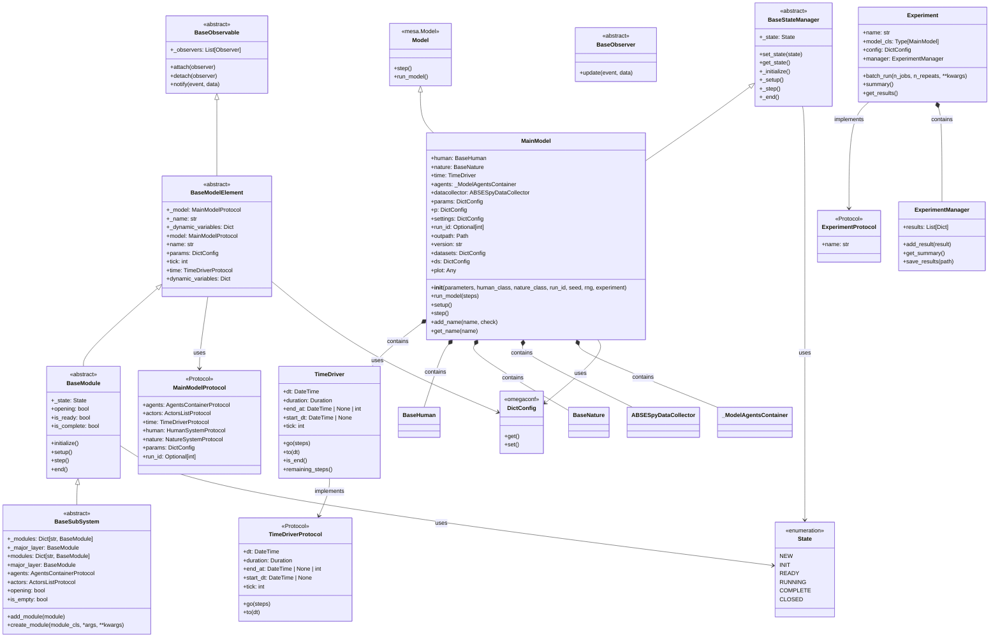

# Core 模块类图

ABSESpy 核心模块的类层次结构和关系图。

## 核心类层次结构

## 关键关系说明

### 继承层次
1. **BaseObservable** → **BaseModelElement** → **BaseModule** → **BaseSubSystem**
2. **Model** (Mesa) → **MainModel** (ABSESpy)
3. **BaseStateManager** → **MainModel**

### 组合关系
- **MainModel** 包含所有核心组件：
  - `TimeDriver`: 时间管理
  - `BaseHuman`: 人类子系统
  - `BaseNature`: 自然子系统
  - `ABSESpyDataCollector`: 数据收集
  - `_ModelAgentsContainer`: 代理容器

### 协议接口
- **MainModelProtocol**: 定义主模型接口
- **TimeDriverProtocol**: 定义时间驱动接口
- **ExperimentProtocol**: 定义实验接口

### 状态管理
- **State**: 枚举定义模块生命周期状态
- **BaseStateManager**: 提供状态转换机制
- **BaseModule**: 实现状态驱动的生命周期

## 核心功能

### 1. 模型生命周期管理
- **NEW** → **INIT** → **READY** → **RUNNING** → **COMPLETE** → **CLOSED**
- 通过 `BaseStateManager` 统一管理状态转换

### 2. 观察者模式
- **BaseObservable**: 可观察对象基类
- **BaseObserver**: 观察者基类
- 用于事件通知和数据收集

### 3. 配置管理
- 使用 `DictConfig` 进行结构化参数管理
- 支持嵌套访问：`model.nature.params.parameter_name`

### 4. 时间驱动
- **TimeDriver**: 管理仿真时间推进
- 支持日期时间和步数两种时间模式

### 5. 实验管理
- **Experiment**: 批量实验执行
- **ExperimentManager**: 结果收集和管理

## 文件引用

- `abses/core/model.py` (61-464行): MainModel 主类
- `abses/core/base_module.py` (38-405行): BaseModelElement, BaseModule
- `abses/core/base_subsystem.py` (31-85行): BaseSubSystem
- `abses/core/time_driver.py`: TimeDriver 时间驱动
- `abses/core/experiment.py`: Experiment 实验管理
- `abses/core/protocols.py`: 协议接口定义
