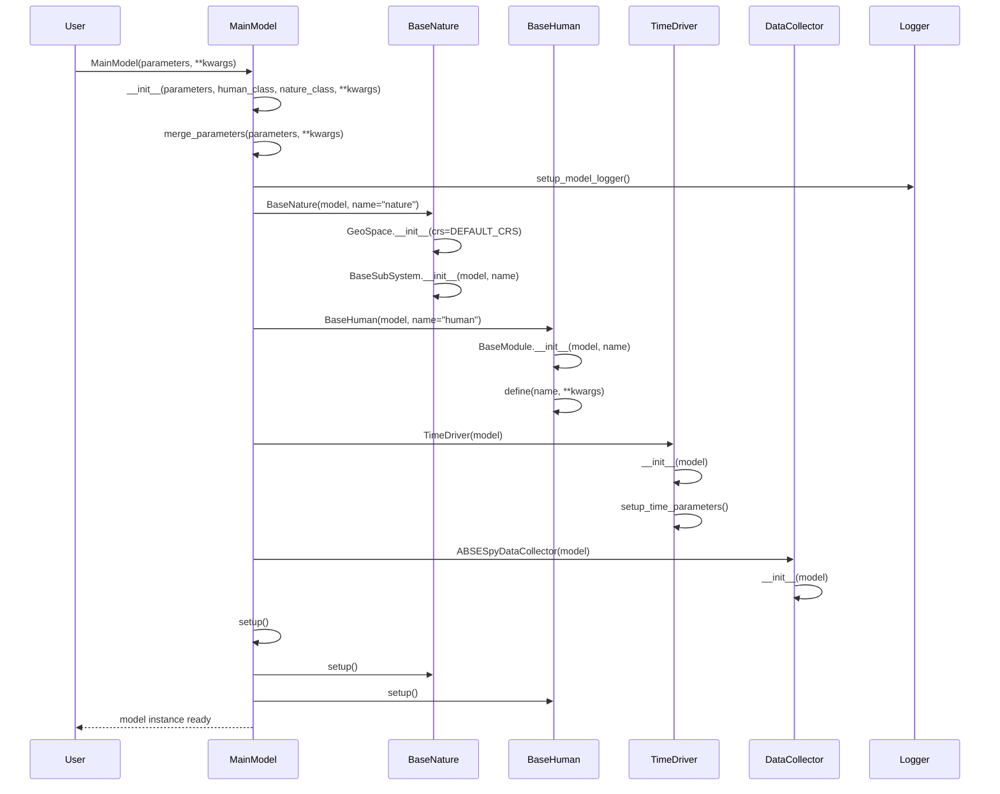
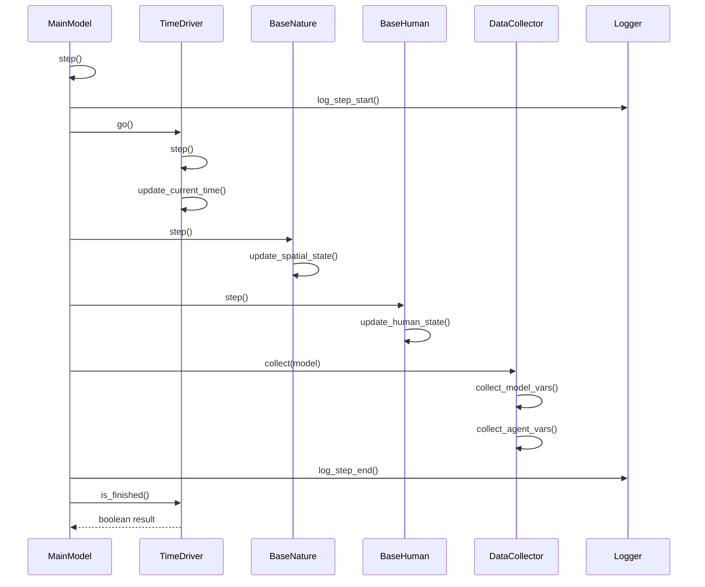
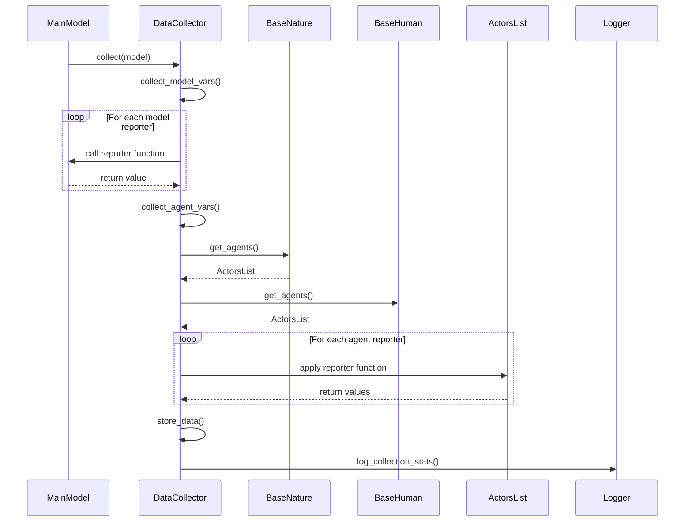
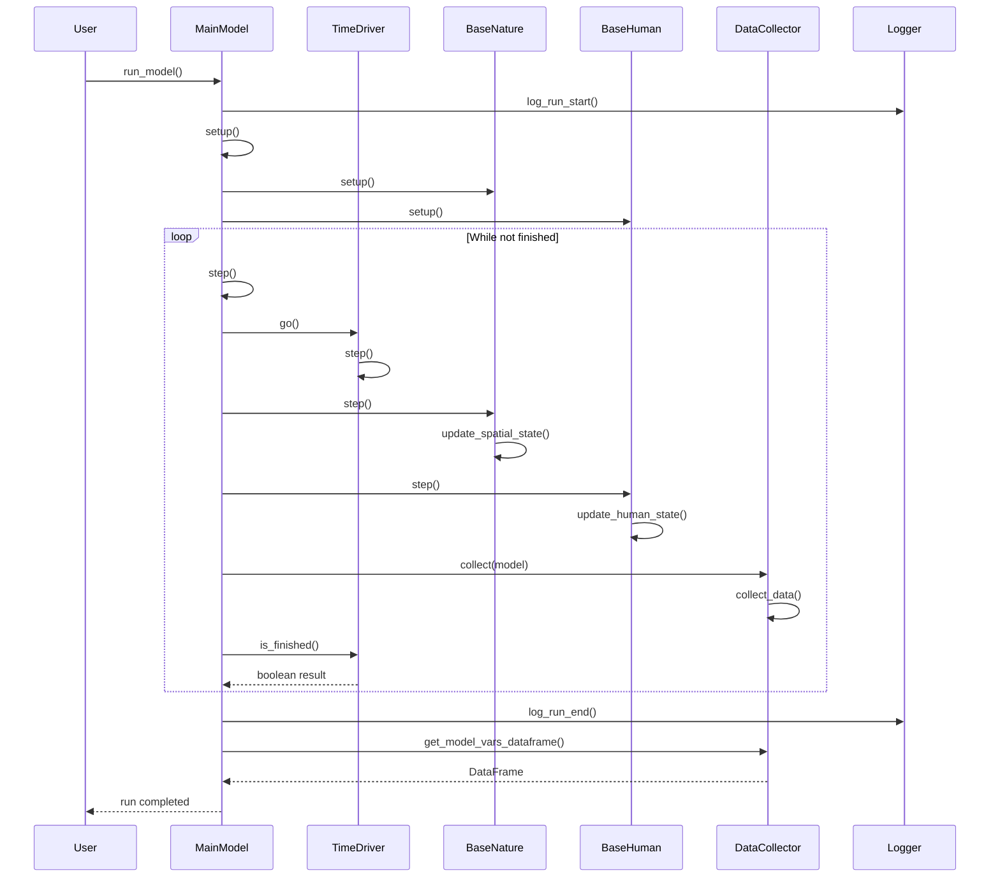
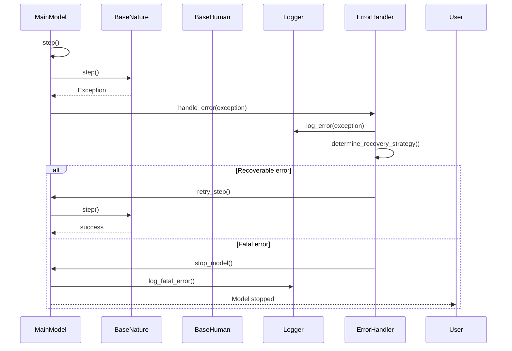

# ABSESpy Core Module Sequence Diagrams

This document contains sequence diagrams for the core module, showing the interactions between MainModel, BaseNature, BaseHuman, TimeDriver, and DataCollector during key operations.

## Model Initialization Sequence

## Model Step Execution Sequence

## Data Collection Sequence

## Model Run Sequence

## Error Handling Sequence

## Key Interactions

### Model Initialization
1. **Parameter Merging**: User parameters are merged with defaults
2. **Subsystem Creation**: BaseNature, BaseHuman, TimeDriver, DataCollector are created
3. **Setup Phase**: All subsystems are initialized in proper order
4. **Logging Setup**: Model-specific logging is configured

### Step Execution
1. **Time Progression**: TimeDriver advances model time
2. **Spatial Updates**: BaseNature updates spatial state
3. **Human Updates**: BaseHuman updates human-related state
4. **Data Collection**: DataCollector gathers model and agent data
5. **Logging**: Step progress is logged

### Data Collection
1. **Model Variables**: Collect model-level data using reporters
2. **Agent Variables**: Collect agent-level data from all subsystems
3. **Storage**: Data is stored for later analysis
4. **Statistics**: Collection statistics are logged

### Error Handling
1. **Exception Capture**: Errors are caught during step execution
2. **Error Classification**: Errors are classified as recoverable or fatal
3. **Recovery Strategy**: Appropriate recovery action is taken
4. **Logging**: All errors are logged with context
