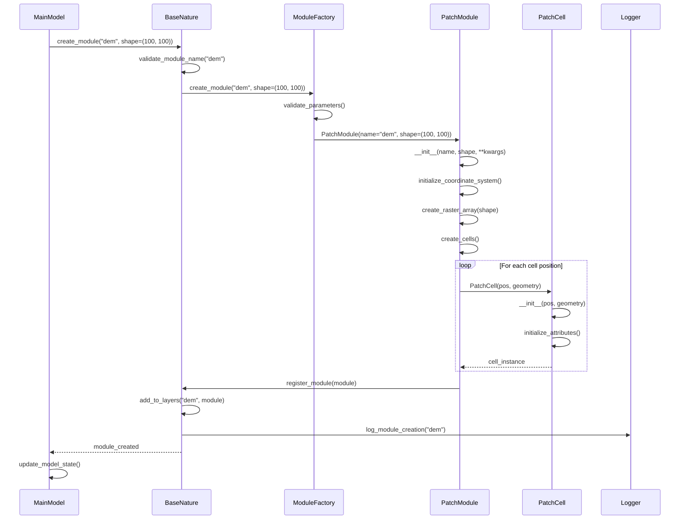
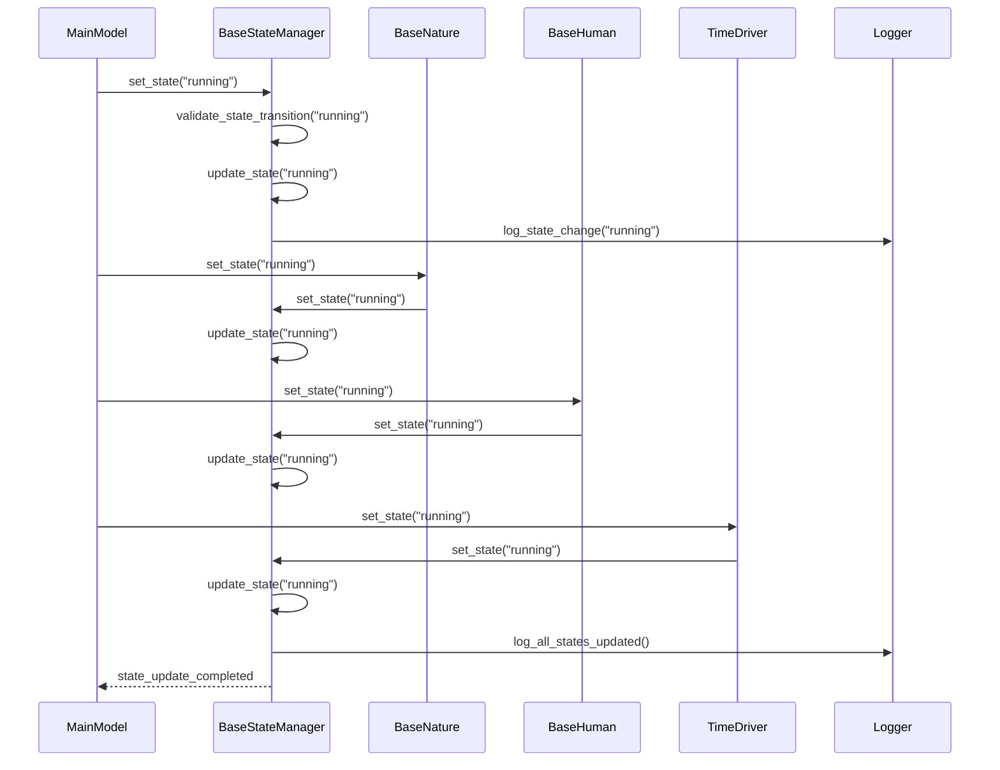
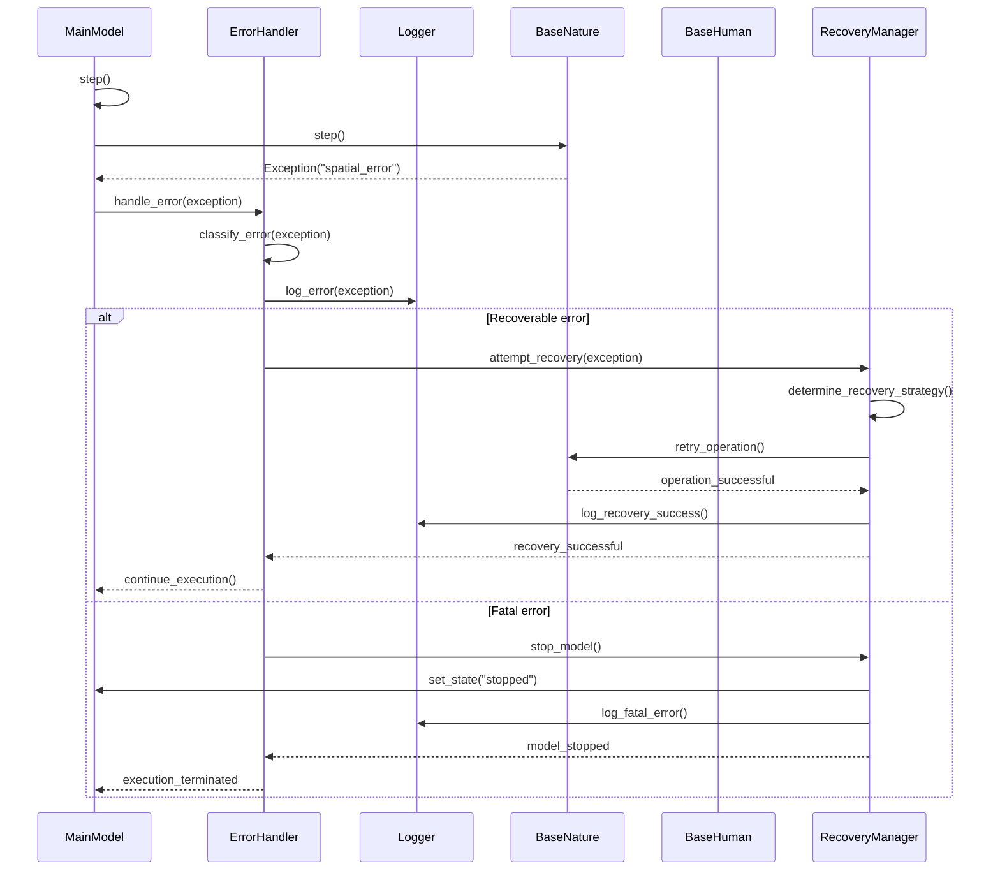

# ABSESpy Internal Flow Sequence Diagrams

This document contains sequence diagrams for internal system processes in ABSESpy, showing how different components interact during system operations.

## Internal Flow 1: Module Lifecycle Management



## Internal Flow 2: State Management



## Internal Flow 3: Observer Pattern Implementation

```mermaid
sequenceDiagram
    participant Actor
    participant Observer
    participant MainModel
    participant BaseNature
    participant BaseHuman
    participant Logger

    Actor->>Observer: register_observer(actor)
    Observer->>Observer: add_to_observers(actor)
    Observer->>Logger: log_observer_registration(actor)

    MainModel->>Observer: notify_observers("state_change")
    Observer->>Observer: get_all_observers()

    loop For each observer
        Observer->>Actor: notify("state_change")
        Actor->>Actor: handle_notification("state_change")
        Actor->>Actor: update_internal_state()
        Actor-->>Observer: notification_handled
    end

    Observer->>Logger: log_all_notifications_sent()
    Observer-->>MainModel: all_observers_notified

    Actor->>Observer: unregister_observer(actor)
    Observer->>Observer: remove_from_observers(actor)
    Observer->>Logger: log_observer_unregistration(actor)
```

## Internal Flow 4: Random Number Generation

```mermaid
sequenceDiagram
    participant MainModel
    participant TimeDriver
    participant np.random.Generator
    participant Actor
    participant PatchCell
    participant Logger

    MainModel->>TimeDriver: initialize_random_seed(seed)
    TimeDriver->>TimeDriver: validate_seed(seed)
    TimeDriver->>np.random.Generator: Generator(seed)
    np.random.Generator-->>TimeDriver: rng_instance

    TimeDriver->>MainModel: set_rng(rng_instance)
    MainModel->>MainModel: propagate_rng_to_subsystems()

    MainModel->>BaseNature: set_rng(rng_instance)
    BaseNature->>PatchModule: set_rng(rng_instance)
    PatchModule->>PatchCell: set_rng(rng_instance)

    MainModel->>BaseHuman: set_rng(rng_instance)
    BaseHuman->>Actor: set_rng(rng_instance)

    Actor->>np.random.Generator: random.choice(options)
    np.random.Generator-->>Actor: random_value

    Actor->>Logger: log_random_operation(random_value)
    Actor-->>MainModel: random_operation_completed
```

## Internal Flow 5: Error Handling and Recovery



## Internal Flow 6: Data Flow and Caching

```mermaid
sequenceDiagram
    participant Actor
    participant PatchCell
    participant PatchModule
    participant xr.DataArray
    participant CacheManager
    participant Logger

    Actor->>PatchCell: cell.fertility

    PatchCell->>CacheManager: check_cache("fertility")
    CacheManager-->>PatchCell: cache_miss

    PatchCell->>PatchModule: get_raster_value(pos, "fertility")
    PatchModule->>PatchModule: validate_attribute("fertility")
    PatchModule->>xr.DataArray: sel(x=pos[0], y=pos[1])
    xr.DataArray-->>PatchModule: raster_value

    PatchModule->>PatchModule: process_value(raster_value)
    PatchModule-->>PatchCell: processed_value

    PatchCell->>CacheManager: store_cache("fertility", processed_value)
    CacheManager->>CacheManager: store_value("fertility", processed_value)
    CacheManager->>Logger: log_cache_store("fertility")

    PatchCell-->>Actor: fertility_value

    Note over Actor,Logger: Subsequent access uses cache

    Actor->>PatchCell: cell.fertility
    PatchCell->>CacheManager: check_cache("fertility")
    CacheManager-->>PatchCell: cache_hit
    PatchCell-->>Actor: cached_value
```

## Key Internal Processes

### Module Lifecycle Management
1. **Validation**: Module parameters are validated before creation
2. **Factory Pattern**: ModuleFactory creates appropriate module instances
3. **Initialization**: Modules are properly initialized with dependencies
4. **Registration**: Modules are registered with their parent containers
5. **State Management**: Module state is tracked throughout lifecycle

### State Management
1. **State Validation**: State transitions are validated before execution
2. **Propagation**: State changes are propagated to all subsystems
3. **Consistency**: All subsystems maintain consistent state
4. **Logging**: State changes are logged for debugging
5. **Recovery**: State can be recovered in case of errors

### Observer Pattern Implementation
1. **Registration**: Observers register with subjects
2. **Notification**: Subjects notify all registered observers
3. **Handling**: Observers handle notifications appropriately
4. **Cleanup**: Observers can unregister when no longer needed
5. **Logging**: All observer operations are logged

### Random Number Generation
1. **Seed Management**: Random seeds are properly managed
2. **Propagation**: RNG instances are propagated to all components
3. **Consistency**: All components use the same RNG instance
4. **Reproducibility**: Results are reproducible with same seed
5. **Logging**: Random operations are logged for debugging

### Error Handling and Recovery
1. **Error Classification**: Errors are classified as recoverable or fatal
2. **Recovery Strategies**: Appropriate recovery strategies are applied
3. **State Management**: Model state is managed during error handling
4. **Logging**: All errors and recovery attempts are logged
5. **Graceful Degradation**: System degrades gracefully on fatal errors

### Data Flow and Caching
1. **Cache Management**: Data is cached for performance
2. **Cache Validation**: Cache validity is checked before use
3. **Data Processing**: Raw data is processed before caching
4. **Cache Invalidation**: Cache is invalidated when data changes
5. **Performance**: Caching improves system performance
