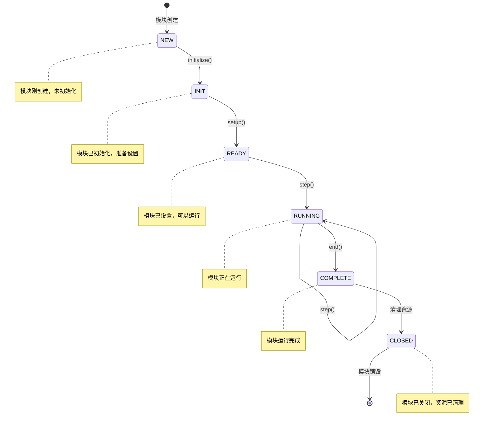
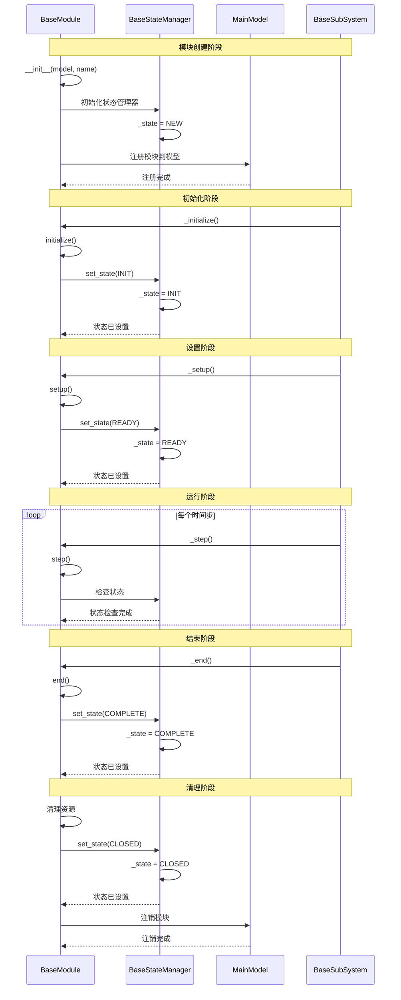

# 模块生命周期

BaseModule 的状态转换和生命周期管理流程。

## 流程描述

ABSESpy 中的模块遵循统一的生命周期管理，从创建到销毁经历多个状态转换，通过 `BaseStateManager` 实现状态驱动的生命周期管理。

## 时序图



## 状态转换流程



## 关键状态说明

### 1. NEW 状态
- 模块刚创建，未进行任何初始化
- 可以设置基本属性，但不能执行核心功能
- 状态转换：`NEW → INIT`

### 2. INIT 状态
- 模块已初始化，准备进行设置
- 可以访问模型和基本配置
- 状态转换：`INIT → READY`

### 3. READY 状态
- 模块已设置完成，可以开始运行
- 所有必要的资源已准备就绪
- 状态转换：`READY → RUNNING`

### 4. RUNNING 状态
- 模块正在运行，执行时间步逻辑
- 可以访问所有功能和资源
- 状态转换：`RUNNING → RUNNING` 或 `RUNNING → COMPLETE`

### 5. COMPLETE 状态
- 模块运行完成，准备清理
- 可以保存结果和清理资源
- 状态转换：`COMPLETE → CLOSED`

### 6. CLOSED 状态
- 模块已关闭，资源已清理
- 不能再执行任何操作
- 状态转换：`CLOSED → [销毁]`

## 状态管理实现

### BaseStateManager 接口
```python
class BaseStateManager:
    def __init__(self):
        self._state = State.NEW

    def set_state(self, state: State):
        self._state = state

    def get_state(self) -> State:
        return self._state

    def is_ready(self) -> bool:
        return self._state == State.READY

    def is_running(self) -> bool:
        return self._state == State.RUNNING

    def is_complete(self) -> bool:
        return self._state == State.COMPLETE
```

### 模块生命周期方法
```python
class BaseModule(BaseStateManager):
    def __init__(self, model: MainModelProtocol, name: str = None):
        super().__init__()
        self._model = model
        self._name = name

    def initialize(self):
        """初始化模块，子类可以重写"""
        pass

    def setup(self):
        """设置模块，子类可以重写"""
        pass

    def step(self):
        """执行时间步，子类必须重写"""
        raise NotImplementedError

    def end(self):
        """结束模块，子类可以重写"""
        pass

    def _initialize(self):
        """内部初始化方法"""
        self.initialize()
        self.set_state(State.INIT)

    def _setup(self):
        """内部设置方法"""
        self.setup()
        self.set_state(State.READY)

    def _step(self):
        """内部步骤方法"""
        if self._state != State.READY:
            raise RuntimeError(f"Module not ready for step, current state: {self._state}")
        self.step()

    def _end(self):
        """内部结束方法"""
        self.end()
        self.set_state(State.COMPLETE)
```

## 状态转换规则

### 1. 正向转换
- `NEW → INIT`: 调用 `initialize()`
- `INIT → READY`: 调用 `setup()`
- `READY → RUNNING`: 调用 `step()`
- `RUNNING → COMPLETE`: 调用 `end()`
- `COMPLETE → CLOSED`: 清理资源

### 2. 状态检查
- 只有 `READY` 状态的模块可以执行 `step()`
- 只有 `RUNNING` 状态的模块可以继续运行
- 只有 `COMPLETE` 状态的模块可以清理资源

### 3. 错误处理
- 状态转换失败时回滚到上一个状态
- 提供状态转换日志和错误信息
- 支持状态恢复和重试机制

## 使用示例

### 自定义模块
```python
class CustomModule(BaseModule):
    def __init__(self, model, name="custom"):
        super().__init__(model, name)
        self.data = []

    def initialize(self):
        """初始化自定义数据"""
        self.data = []
        print(f"Module {self.name} initialized")

    def setup(self):
        """设置模块配置"""
        self.data.append("setup")
        print(f"Module {self.name} setup complete")

    def step(self):
        """执行时间步逻辑"""
        self.data.append(f"step_{self.model.time.tick}")
        print(f"Module {self.name} step {self.model.time.tick}")

    def end(self):
        """结束模块"""
        self.data.append("end")
        print(f"Module {self.name} ended")
```

### 状态监控
```python
class MonitoredModule(BaseModule):
    def __init__(self, model, name="monitored"):
        super().__init__(model, name)
        self.state_history = []

    def set_state(self, state):
        super().set_state(state)
        self.state_history.append({
            "tick": self.model.time.tick,
            "state": state,
            "timestamp": datetime.now()
        })

    def get_state_history(self):
        return self.state_history
```

## 相关文件

- `abses/core/base_module.py`: BaseModule 基类
- `abses/core/base.py`: BaseStateManager 状态管理
- `abses/core/primitives.py`: State 枚举定义
- `abses/core/base_subsystem.py`: BaseSubSystem 子系统
- `abses/core/model.py`: MainModel 主模型
