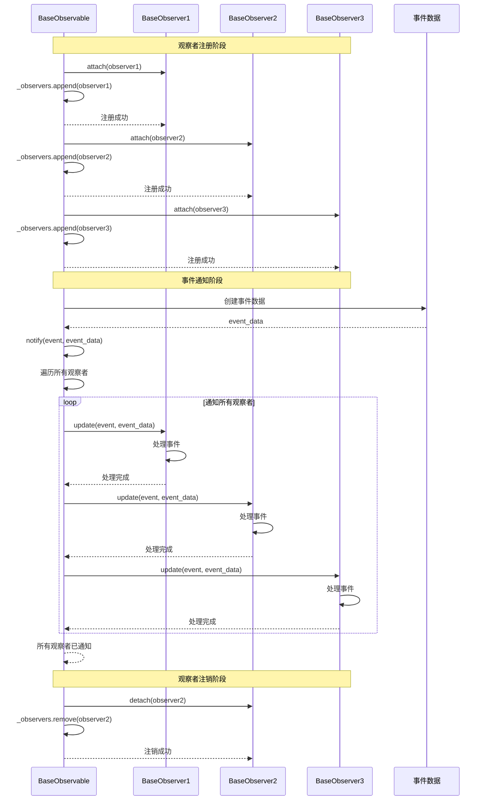

# 观察者模式

Observable 通知 Observer 的事件通知机制流程。

## 流程描述

ABSESpy 使用观察者模式实现事件通知和数据收集，`BaseObservable` 对象可以注册多个 `BaseObserver`，当事件发生时自动通知所有观察者。

## 时序图



## 关键组件说明

### 1. BaseObservable
- 可观察对象基类
- 维护观察者列表
- 提供事件通知功能

### 2. BaseObserver
- 观察者基类
- 实现事件处理方法
- 响应可观察对象的事件

### 3. 事件数据
- 包含事件类型和相关信息
- 可以是任意类型的数据
- 支持结构化事件数据

## 观察者模式实现

### BaseObservable 实现
```python
class BaseObservable:
    def __init__(self):
        self._observers: List[BaseObserver] = []

    def attach(self, observer: BaseObserver):
        """注册观察者"""
        if observer not in self._observers:
            self._observers.append(observer)

    def detach(self, observer: BaseObserver):
        """注销观察者"""
        if observer in self._observers:
            self._observers.remove(observer)

    def notify(self, event: str, data: Any = None):
        """通知所有观察者"""
        for observer in self._observers:
            try:
                observer.update(event, data)
            except Exception as e:
                logger.error(f"Observer {observer} failed to handle event {event}: {e}")

    def clear_observers(self):
        """清空所有观察者"""
        self._observers.clear()

    @property
    def observers(self) -> List[BaseObserver]:
        """获取观察者列表"""
        return self._observers.copy()
```

### BaseObserver 实现
```python
class BaseObserver:
    def update(self, event: str, data: Any = None):
        """处理事件通知"""
        raise NotImplementedError("Subclasses must implement update method")

    def __str__(self):
        return f"{self.__class__.__name__}"
```

## 使用示例

### 数据收集观察者
```python
class DataCollectorObserver(BaseObserver):
    def __init__(self, collector):
        self.collector = collector
        self.data = []

    def update(self, event: str, data: Any = None):
        """收集数据"""
        if event == "agent_created":
            self.data.append({
                "tick": self.collector.model.time.tick,
                "event": event,
                "agent_id": data.get("agent_id"),
                "agent_type": data.get("agent_type")
            })
        elif event == "agent_died":
            self.data.append({
                "tick": self.collector.model.time.tick,
                "event": event,
                "agent_id": data.get("agent_id")
            })

    def get_data(self):
        """获取收集的数据"""
        return self.data
```

### 日志观察者
```python
class LoggingObserver(BaseObserver):
    def __init__(self, log_level="INFO"):
        self.log_level = log_level
        self.logger = logging.getLogger("ABSESpy")

    def update(self, event: str, data: Any = None):
        """记录日志"""
        message = f"Event: {event}"
        if data:
            message += f", Data: {data}"

        if self.log_level == "DEBUG":
            self.logger.debug(message)
        elif self.log_level == "INFO":
            self.logger.info(message)
        elif self.log_level == "WARNING":
            self.logger.warning(message)
        elif self.log_level == "ERROR":
            self.logger.error(message)
```

### 性能监控观察者
```python
class PerformanceObserver(BaseObserver):
    def __init__(self):
        self.metrics = {
            "event_counts": {},
            "processing_times": {},
            "memory_usage": []
        }

    def update(self, event: str, data: Any = None):
        """记录性能指标"""
        # 记录事件计数
        if event not in self.metrics["event_counts"]:
            self.metrics["event_counts"][event] = 0
        self.metrics["event_counts"][event] += 1

        # 记录处理时间
        if data and "processing_time" in data:
            if event not in self.metrics["processing_times"]:
                self.metrics["processing_times"][event] = []
            self.metrics["processing_times"][event].append(data["processing_time"])

        # 记录内存使用
        import psutil
        memory_usage = psutil.Process().memory_info().rss / 1024 / 1024  # MB
        self.metrics["memory_usage"].append(memory_usage)

    def get_metrics(self):
        """获取性能指标"""
        return self.metrics
```

## 事件类型定义

### 模型事件
```python
MODEL_EVENTS = {
    "model_created": "模型创建",
    "model_initialized": "模型初始化",
    "model_step_start": "模型步骤开始",
    "model_step_end": "模型步骤结束",
    "model_ended": "模型结束"
}
```

### 代理事件
```python
AGENT_EVENTS = {
    "agent_created": "代理创建",
    "agent_died": "代理死亡",
    "agent_moved": "代理移动",
    "agent_interacted": "代理交互",
    "agent_state_changed": "代理状态改变"
}
```

### 空间事件
```python
SPATIAL_EVENTS = {
    "cell_created": "单元格创建",
    "cell_updated": "单元格更新",
    "raster_applied": "栅格数据应用",
    "spatial_query": "空间查询"
}
```

## 事件通知使用

### 在模型中通知事件
```python
class ObservableModel(MainModel):
    def __init__(self, parameters, **kwargs):
        super().__init__(parameters, **kwargs)
        self.setup_observers()

    def setup_observers(self):
        """设置观察者"""
        self.attach(DataCollectorObserver(self.datacollector))
        self.attach(LoggingObserver())
        self.attach(PerformanceObserver())

    def step(self):
        """执行时间步"""
        self.notify("model_step_start", {"tick": self.time.tick})

        super().step()

        self.notify("model_step_end", {"tick": self.time.tick})

    def create_agent(self, agent_class, **kwargs):
        """创建代理"""
        agent = super().create_agent(agent_class, **kwargs)
        self.notify("agent_created", {
            "agent_id": agent.unique_id,
            "agent_type": agent_class.__name__
        })
        return agent
```

### 在代理中通知事件
```python
class ObservableActor(Actor):
    def __init__(self, model, **kwargs):
        super().__init__(model, **kwargs)
        self.setup_observers()

    def setup_observers(self):
        """设置观察者"""
        self.attach(AgentBehaviorObserver())

    def move_to(self, target):
        """移动到目标位置"""
        old_pos = self.pos
        super().move_to(target)
        self.notify("agent_moved", {
            "agent_id": self.unique_id,
            "old_pos": old_pos,
            "new_pos": self.pos
        })

    def die(self):
        """死亡"""
        super().die()
        self.notify("agent_died", {
            "agent_id": self.unique_id,
            "final_pos": self.pos
        })
```

## 事件过滤和路由

### 事件过滤器
```python
class EventFilter(BaseObserver):
    def __init__(self, target_observer, event_types):
        self.target_observer = target_observer
        self.event_types = event_types

    def update(self, event: str, data: Any = None):
        """过滤事件"""
        if event in self.event_types:
            self.target_observer.update(event, data)
```

### 事件路由器
```python
class EventRouter(BaseObserver):
    def __init__(self):
        self.routes = {}

    def add_route(self, event_type, observer):
        """添加路由"""
        if event_type not in self.routes:
            self.routes[event_type] = []
        self.routes[event_type].append(observer)

    def update(self, event: str, data: Any = None):
        """路由事件"""
        if event in self.routes:
            for observer in self.routes[event]:
                observer.update(event, data)
```

## 相关文件

- `abses/core/base_observable.py`: BaseObservable 可观察对象
- `abses/core/base_observer.py`: BaseObserver 观察者
- `abses/core/base_module.py`: BaseModelElement 模型元素
- `abses/utils/datacollector.py`: ABSESpyDataCollector 数据收集器
- `abses/core/model.py`: MainModel 主模型
