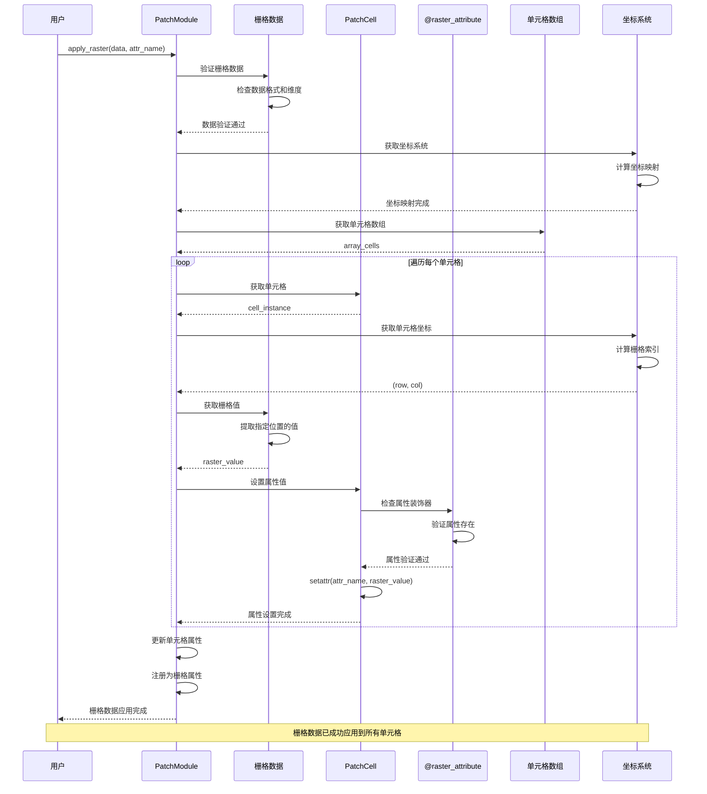

# 栅格数据应用

将栅格数据应用到单元格的完整流程。

## 流程描述

系统将栅格数据（如高程、土地利用、土壤类型等）应用到空间模块的单元格中，通过 `@raster_attribute` 装饰器实现属性提取和设置。

## 时序图



## 关键步骤说明

### 1. 数据验证
- 验证栅格数据的格式和维度
- 检查数据与空间模块的兼容性
- 确保数据类型正确

### 2. 坐标映射
- 获取空间模块的坐标系统
- 计算栅格数据与单元格的坐标映射
- 建立索引对应关系

### 3. 单元格遍历
- 遍历空间模块中的所有单元格
- 获取每个单元格的坐标位置
- 计算对应的栅格索引

### 4. 值提取和设置
- 从栅格数据中提取指定位置的值
- 检查单元格属性的装饰器
- 设置单元格属性值

### 5. 属性注册
- 将新属性注册为栅格属性
- 更新模块的属性列表
- 完成数据应用过程

## 栅格数据应用实现

### PatchModule 核心方法
```python
class PatchModule(BaseModule, RasterLayer):
    def apply_raster(self, data: np.ndarray | xr.DataArray, attr_name: str):
        """应用栅格数据到单元格"""
        # 验证数据
        if isinstance(data, xr.DataArray):
            data = data.values

        if data.ndim != 2:
            raise ValueError("Raster data must be 2D")

        if data.shape != self.shape2d:
            raise ValueError(f"Data shape {data.shape} doesn't match module shape {self.shape2d}")

        # 应用数据到单元格
        for i in range(self.shape2d[0]):
            for j in range(self.shape2d[1]):
                cell = self.array_cells[i, j]
                value = data[i, j]

                # 检查属性是否存在
                if not hasattr(cell, attr_name):
                    raise AttributeError(f"Cell {cell.__class__.__name__} has no attribute {attr_name}")

                # 设置属性值
                setattr(cell, attr_name, value)

        # 注册为栅格属性
        self._register_raster_attribute(attr_name)

    def _register_raster_attribute(self, attr_name: str):
        """注册栅格属性"""
        if attr_name not in self.cell_properties:
            self.cell_properties.add(attr_name)
            self.attributes.add(attr_name)
```

### 栅格属性装饰器
```python
def raster_attribute(func_or_property):
    """栅格属性装饰器"""
    if isinstance(func_or_property, property):
        # 如果已经是一个 property，保留其 getter 和 setter
        prop = func_or_property
        setattr(prop.fget, "is_decorated", True)
        return prop
    else:
        # 如果是一个普通方法，将其转换为 property
        func = func_or_property
        setattr(func, "is_decorated", True)
        return property(func)
```

### 自定义单元格类
```python
class CustomCell(PatchCell):
    def __init__(self, *args, **kwargs):
        super().__init__(*args, **kwargs)
        self._elevation = 0.0
        self._fertility = 0.5
        self._water = 0.0
        self._landuse = "unknown"

    @raster_attribute
    def elevation(self):
        """高程属性"""
        return self._elevation

    @elevation.setter
    def elevation(self, value):
        self._elevation = float(value)

    @raster_attribute
    def fertility(self):
        """肥力属性"""
        return self._fertility

    @fertility.setter
    def fertility(self, value):
        self._fertility = max(0.0, min(1.0, float(value)))

    @raster_attribute
    def water(self):
        """水资源属性"""
        return self._water

    @water.setter
    def water(self, value):
        self._water = max(0.0, float(value))

    @raster_attribute
    def landuse(self):
        """土地利用属性"""
        return self._landuse

    @landuse.setter
    def landuse(self, value):
        self._landuse = str(value)
```

## 使用示例

### 基本栅格数据应用
```python
# 创建空间模块
module = model.nature.create_module(
    shape=(100, 100),
    resolution=1.0,
    cell_cls=CustomCell,
    name="landscape"
)

# 创建栅格数据
elevation_data = np.random.rand(100, 100) * 1000  # 高程数据
fertility_data = np.random.rand(100, 100)  # 肥力数据
water_data = np.random.rand(100, 100) * 100  # 水资源数据

# 应用栅格数据
module.apply_raster(elevation_data, "elevation")
module.apply_raster(fertility_data, "fertility")
module.apply_raster(water_data, "water")

# 检查应用结果
print(f"模块属性: {module.cell_properties}")
print(f"单元格高程: {module.get_cell((50, 50)).elevation}")
print(f"单元格肥力: {module.get_cell((50, 50)).fertility}")
```

### 从文件应用栅格数据
```python
# 从栅格文件应用
elevation_module = PatchModule.from_raster(
    model=model,
    raster_file="elevation.tif",
    attr_name="elevation",
    name="elevation"
)

# 从 xarray 应用
import xarray as xr
temperature_data = xr.open_dataarray("temperature.nc")
temperature_module = PatchModule.from_xarray(
    model=model,
    xda=temperature_data,
    attr_name="temperature",
    name="temperature"
)
```

### 批量栅格数据应用
```python
# 批量应用多个栅格数据
raster_files = {
    "elevation": "elevation.tif",
    "slope": "slope.tif",
    "aspect": "aspect.tif",
    "landuse": "landuse.tif"
}

for attr_name, file_path in raster_files.items():
    data = rasterio.open(file_path).read(1)
    module.apply_raster(data, attr_name)

print(f"应用后的属性: {module.cell_properties}")
```

### 栅格数据查询和操作
```python
# 获取栅格数据
elevation_array = module.get_raster("elevation")
fertility_array = module.get_raster("fertility")

# 设置栅格数据
new_elevation = elevation_array + 100  # 整体抬高100米
module.set_raster("elevation", new_elevation)

# 条件查询
high_elevation_cells = module.get_cells(lambda c: c.elevation > 800)
fertile_cells = module.get_cells(lambda c: c.fertility > 0.7)

# 批量更新
module.cells_lst.update("fertility", 0.8)  # 设置所有单元格肥力为0.8
```

## 高级功能

### 栅格数据重采样
```python
def resample_raster_data(data, target_shape):
    """重采样栅格数据"""
    from scipy.ndimage import zoom

    zoom_factors = (
        target_shape[0] / data.shape[0],
        target_shape[1] / data.shape[1]
    )

    return zoom(data, zoom_factors, order=1)

# 应用重采样数据
original_data = np.random.rand(50, 50)
resampled_data = resample_raster_data(original_data, (100, 100))
module.apply_raster(resampled_data, "resampled_attr")
```

### 栅格数据插值
```python
def interpolate_raster_data(data, method="linear"):
    """插值栅格数据"""
    from scipy.interpolate import griddata

    # 创建网格
    x = np.linspace(0, 1, data.shape[1])
    y = np.linspace(0, 1, data.shape[0])
    X, Y = np.meshgrid(x, y)

    # 插值
    points = np.column_stack((X.ravel(), Y.ravel()))
    values = data.ravel()

    return griddata(points, values, (X, Y), method=method)

# 应用插值数据
sparse_data = np.random.rand(20, 20)
interpolated_data = interpolate_raster_data(sparse_data)
module.apply_raster(interpolated_data, "interpolated_attr")
```

### 栅格数据统计
```python
def analyze_raster_attributes(module):
    """分析栅格属性统计"""
    stats = {}

    for attr_name in module.cell_properties:
        values = module.array_cells.flatten()
        attr_values = [getattr(cell, attr_name) for cell in values]

        stats[attr_name] = {
            "mean": np.mean(attr_values),
            "std": np.std(attr_values),
            "min": np.min(attr_values),
            "max": np.max(attr_values),
            "median": np.median(attr_values)
        }

    return stats

# 分析模块属性
stats = analyze_raster_attributes(module)
for attr_name, stat in stats.items():
    print(f"{attr_name}: 均值={stat['mean']:.2f}, 标准差={stat['std']:.2f}")
```

## 性能优化

### 向量化操作
```python
def vectorized_apply_raster(self, data, attr_name):
    """向量化应用栅格数据"""
    # 将数据重塑为与单元格数组相同的形状
    data_reshaped = data.reshape(self.array_cells.shape)

    # 向量化设置属性
    for i in range(self.shape2d[0]):
        for j in range(self.shape2d[1]):
            setattr(self.array_cells[i, j], attr_name, data_reshaped[i, j])

    self._register_raster_attribute(attr_name)
```

### 内存优化
```python
def memory_efficient_apply_raster(self, data, attr_name, chunk_size=1000):
    """内存高效应用栅格数据"""
    total_cells = self.shape2d[0] * self.shape2d[1]

    for start_idx in range(0, total_cells, chunk_size):
        end_idx = min(start_idx + chunk_size, total_cells)

        for idx in range(start_idx, end_idx):
            i, j = divmod(idx, self.shape2d[1])
            cell = self.array_cells[i, j]
            value = data[i, j]
            setattr(cell, attr_name, value)

        # 清理内存
        if start_idx % (chunk_size * 10) == 0:
            import gc
            gc.collect()
```

## 相关文件

- `abses/space/patch.py`: PatchModule 栅格模块
- `abses/space/cells.py`: PatchCell 栅格单元
- `abses/space/nature.py`: BaseNature 空间子系统
- `abses/core/base_module.py`: BaseModule 基类
- `abses/core/primitives.py`: 基础类型定义
