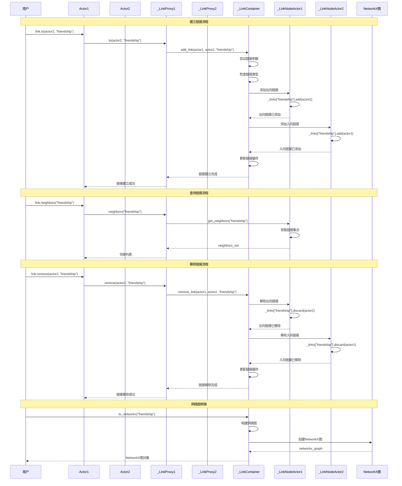

# 网络链接管理

Actor 之间建立和管理网络链接的完整流程。

## 流程描述

系统管理 Actor 之间的网络链接关系，支持多种链接类型，提供链接的建立、移除、查询等功能，确保网络关系的一致性和高效访问。

## 时序图



## 关键组件说明

### 1. _LinkContainer
- 全局链接容器，管理所有链接关系
- 维护链接的增删改查操作
- 提供网络图转换功能

### 2. _LinkNodeActor
- Actor 的链接节点功能
- 维护出向和入向链接集合
- 提供链接查询和操作接口

### 3. _LinkProxy
- 链接操作代理，简化链接操作
- 提供用户友好的链接接口
- 封装复杂的链接管理逻辑

### 4. 链接类型
- 支持多种链接类型（friendship, family, work等）
- 每种类型独立管理
- 支持自定义链接类型

## 网络链接实现

### _LinkContainer 核心方法
```python
class _LinkContainer:
    def __init__(self, model=None):
        self._back_links: Dict[str, Dict[UniqueID, Set[UniqueID]]] = {}
        self._links: Dict[str, Dict[UniqueID, Set[UniqueID]]] = {}
        self._cached_networks: Dict[str, object] = {}
        self._node_cache: Dict[UniqueID, LinkingNode] = {}

    def add_link(self, source: LinkingNode, target: LinkingNode, link_type: str):
        """添加链接"""
        if link_type not in self._links:
            self._add_a_link_name(link_type)

        source_id = self._cache_node(source)
        target_id = self._cache_node(target)

        # 添加出向链接
        if source_id not in self._links[link_type]:
            self._links[link_type][source_id] = set()
        self._links[link_type][source_id].add(target_id)

        # 添加入向链接
        if target_id not in self._back_links[link_type]:
            self._back_links[link_type][target_id] = set()
        self._back_links[link_type][target_id].add(source_id)

        # 清除缓存
        self.clear_cache()

    def remove_link(self, source: LinkingNode, target: LinkingNode, link_type: str):
        """移除链接"""
        if link_type not in self._links:
            return

        source_id = source.unique_id
        target_id = target.unique_id

        # 移除出向链接
        if source_id in self._links[link_type]:
            self._links[link_type][source_id].discard(target_id)
            if not self._links[link_type][source_id]:
                del self._links[link_type][source_id]

        # 移除入向链接
        if target_id in self._back_links[link_type]:
            self._back_links[link_type][target_id].discard(source_id)
            if not self._back_links[link_type][target_id]:
                del self._back_links[link_type][target_id]

        # 清除缓存
        self.clear_cache()

    def get_neighbors(self, node: LinkingNode, link_type: str) -> List[LinkingNode]:
        """获取邻居节点"""
        if link_type not in self._links:
            return []

        node_id = node.unique_id
        neighbor_ids = self._links[link_type].get(node_id, set())

        return [self._get_node(nid) for nid in neighbor_ids if nid in self._node_cache]
```

### _LinkNodeActor 实现
```python
class _LinkNodeActor:
    def __init__(self):
        self._links: Dict[str, Set[ActorProtocol]] = {}

    def add_link(self, target: ActorProtocol, link_type: str):
        """添加链接"""
        if link_type not in self._links:
            self._links[link_type] = set()
        self._links[link_type].add(target)

    def remove_link(self, target: ActorProtocol, link_type: str):
        """移除链接"""
        if link_type in self._links:
            self._links[link_type].discard(target)
            if not self._links[link_type]:
                del self._links[link_type]

    def get_neighbors(self, link_type: str) -> List[ActorProtocol]:
        """获取邻居"""
        return list(self._links.get(link_type, set()))

    def get_links(self, link_type: str) -> Set[ActorProtocol]:
        """获取链接集合"""
        return self._links.get(link_type, set())
```

### _LinkProxy 实现
```python
class _LinkProxy:
    def __init__(self, actor: ActorProtocol):
        self.actor = actor

    def to(self, target: ActorProtocol, link_type: str):
        """建立到目标的链接"""
        self.actor.model.human.link_container.add_link(
            self.actor, target, link_type
        )

    def from_(self, source: ActorProtocol, link_type: str):
        """建立从源的链接"""
        self.actor.model.human.link_container.add_link(
            source, self.actor, link_type
        )

    def remove(self, target: ActorProtocol, link_type: str):
        """移除链接"""
        self.actor.model.human.link_container.remove_link(
            self.actor, target, link_type
        )

    def neighbors(self, link_type: str) -> List[ActorProtocol]:
        """获取邻居"""
        return self.actor.model.human.link_container.get_neighbors(
            self.actor, link_type
        )

    def get(self, link_type: str) -> Set[ActorProtocol]:
        """获取链接集合"""
        return self.actor.model.human.link_container.get_links(
            self.actor, link_type
        )
```

## 使用示例

### 基本链接操作
```python
# 创建代理
actor1 = model.agents.new(Actor, num=1).item()
actor2 = model.agents.new(Actor, num=1).item()
actor3 = model.agents.new(Actor, num=1).item()

# 建立友谊链接
actor1.link.to(actor2, "friendship")
actor1.link.to(actor3, "friendship")
actor2.link.to(actor3, "friendship")

# 建立家庭链接
actor1.link.to(actor2, "family")

# 建立工作链接
actor1.link.to(actor3, "work")
```

### 链接查询
```python
# 获取友谊邻居
friends = actor1.link.neighbors("friendship")
print(f"Actor1的朋友: {[f.unique_id for f in friends]}")

# 获取家庭链接
family = actor1.link.get("family")
print(f"Actor1的家庭成员: {[f.unique_id for f in family]}")

# 获取所有链接类型
all_links = actor1.link.get_all_links()
print(f"Actor1的所有链接: {all_links}")
```

### 批量链接操作
```python
# 批量建立链接
farmers = model.agents[Farmer]
hunters = model.agents[Hunter]

# 建立农民之间的合作链接
for i, farmer1 in enumerate(farmers):
    for farmer2 in farmers[i+1:]:
        farmer1.link.to(farmer2, "cooperation")

# 建立农民和猎人的交易链接
for farmer in farmers:
    for hunter in hunters:
        farmer.link.to(hunter, "trade")
```

### 网络分析
```python
# 转换为NetworkX图
import networkx as nx

# 获取友谊网络
friendship_graph = model.human.link_container.to_networkx("friendship")

# 计算网络指标
centrality = nx.betweenness_centrality(friendship_graph)
clustering = nx.clustering(friendship_graph)
density = nx.density(friendship_graph)

print(f"网络密度: {density}")
print(f"聚类系数: {clustering}")
print(f"中心性: {centrality}")
```

## 高级功能

### 动态链接管理
```python
class DynamicLinkManager:
    def __init__(self, model):
        self.model = model
        self.link_rules = {}

    def add_link_rule(self, link_type, rule_func):
        """添加链接规则"""
        self.link_rules[link_type] = rule_func

    def update_links(self):
        """更新链接"""
        for link_type, rule_func in self.link_rules.items():
            self._apply_link_rule(link_type, rule_func)

    def _apply_link_rule(self, link_type, rule_func):
        """应用链接规则"""
        actors = list(self.model.agents)

        for actor1 in actors:
            for actor2 in actors:
                if actor1 != actor2 and rule_func(actor1, actor2):
                    actor1.link.to(actor2, link_type)

# 使用动态链接管理
link_manager = DynamicLinkManager(model)

# 添加距离规则
def distance_rule(actor1, actor2):
    return actor1.distance_to(actor2) < 5

link_manager.add_link_rule("neighbor", distance_rule)
link_manager.update_links()
```

### 链接权重管理
```python
class WeightedLinkContainer(_LinkContainer):
    def __init__(self, model=None):
        super().__init__(model)
        self._link_weights: Dict[str, Dict[Tuple[UniqueID, UniqueID], float]] = {}

    def add_weighted_link(self, source, target, link_type, weight=1.0):
        """添加带权重的链接"""
        super().add_link(source, target, link_type)

        if link_type not in self._link_weights:
            self._link_weights[link_type] = {}

        source_id = source.unique_id
        target_id = target.unique_id
        self._link_weights[link_type][(source_id, target_id)] = weight

    def get_link_weight(self, source, target, link_type):
        """获取链接权重"""
        source_id = source.unique_id
        target_id = target.unique_id
        return self._link_weights.get(link_type, {}).get((source_id, target_id), 1.0)
```

### 链接持久化
```python
class PersistentLinkContainer(_LinkContainer):
    def save_links(self, filepath):
        """保存链接到文件"""
        import pickle

        data = {
            "links": self._links,
            "back_links": self._back_links,
            "node_cache": self._node_cache
        }

        with open(filepath, "wb") as f:
            pickle.dump(data, f)

    def load_links(self, filepath):
        """从文件加载链接"""
        import pickle

        with open(filepath, "rb") as f:
            data = pickle.load(f)

        self._links = data["links"]
        self._back_links = data["back_links"]
        self._node_cache = data["node_cache"]
```

## 性能优化

### 链接缓存
```python
class CachedLinkContainer(_LinkContainer):
    def __init__(self, model=None):
        super().__init__(model)
        self._neighbor_cache = {}
        self._cache_ttl = 10

    def get_neighbors(self, node, link_type):
        """带缓存的邻居查询"""
        cache_key = (node.unique_id, link_type)

        if cache_key in self._neighbor_cache:
            neighbors, timestamp = self._neighbor_cache[cache_key]
            if time.time() - timestamp < self._cache_ttl:
                return neighbors

        neighbors = super().get_neighbors(node, link_type)
        self._neighbor_cache[cache_key] = (neighbors, time.time())

        return neighbors
```

### 批量操作优化
```python
def batch_add_links(container, links_data):
    """批量添加链接"""
    for link_type, links in links_data.items():
        if link_type not in container._links:
            container._add_a_link_name(link_type)

        for source, target in links:
            container.add_link(source, target, link_type)

    container.clear_cache()
```

## 相关文件

- `abses/human/links.py`: 链接管理功能
- `abses/agents/actor.py`: Actor 代理基类
- `abses/space/cells.py`: PatchCell 栅格单元
- `abses/human/human.py`: BaseHuman 人类子系统
- `abses/core/model.py`: MainModel 主模型
