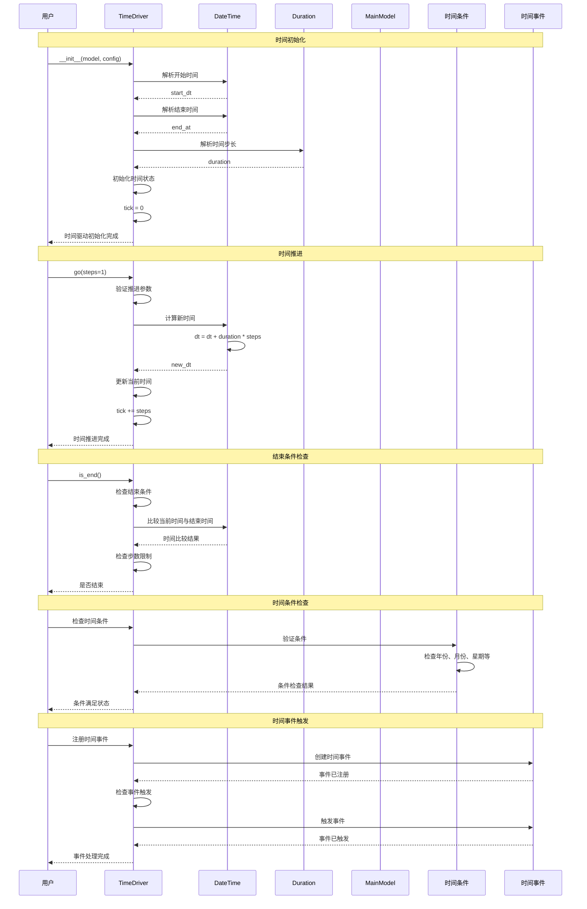

# 时间驱动机制

TimeDriver 管理时间推进的完整流程。

## 流程描述

TimeDriver 负责管理模型的时间推进，支持日期时间和步数两种时间模式，提供时间查询、条件检查、时间转换等功能。

## 时序图



## 关键组件说明

### 1. TimeDriver
- 时间驱动核心类
- 管理时间状态和推进
- 提供时间查询和条件检查

### 2. DateTime
- 当前时间对象
- 支持日期时间操作
- 提供时间格式化功能

### 3. Duration
- 时间步长对象
- 定义时间推进单位
- 支持多种时间单位

### 4. 时间条件
- 时间相关的条件检查
- 支持年份、月份、星期等条件
- 提供时间事件触发机制

## 时间驱动实现

### TimeDriver 核心方法
```python
class TimeDriver:
    def __init__(self, model: MainModelProtocol, config: DictConfig):
        self.model = model
        self._parse_time_config(config)
        self._initialize_time_state()

    def _parse_time_config(self, config: DictConfig):
        """解析时间配置"""
        # 解析开始时间
        self.start_dt = parse_datetime(config.get("start", "2020-01-01"))

        # 解析结束时间
        self.end_at = parse_datetime(config.get("end", "2025-12-31"))

        # 解析时间步长
        self.duration = parse_duration(config.get("freq", "1Y"))

        # 初始化当前时间
        self.dt = self.start_dt
        self.tick = 0

    def go(self, steps: int = 1):
        """推进时间"""
        if steps <= 0:
            raise ValueError("Steps must be positive")

        # 推进时间
        self.dt = self.dt.add(seconds=self.duration.total_seconds() * steps)
        self.tick += steps

        # 检查时间事件
        self._check_time_events()

    def is_end(self) -> bool:
        """检查是否到达结束时间"""
        if isinstance(self.end_at, int):
            return self.tick >= self.end_at
        else:
            return self.dt >= self.end_at

    def remaining_steps(self) -> int:
        """计算剩余步数"""
        if isinstance(self.end_at, int):
            return max(0, self.end_at - self.tick)
        else:
            remaining_time = self.end_at - self.dt
            return max(0, int(remaining_time.total_seconds() / self.duration.total_seconds()))

    def to(self, target_time: DateTime | str):
        """跳转到指定时间"""
        if isinstance(target_time, str):
            target_time = parse_datetime(target_time)

        if target_time < self.dt:
            raise ValueError("Cannot go backwards in time")

        # 计算需要的步数
        time_diff = target_time - self.dt
        steps = int(time_diff.total_seconds() / self.duration.total_seconds())

        # 推进时间
        self.go(steps)
```

### 时间条件装饰器
```python
def time_condition(condition: dict, when_run: bool = True):
    """时间条件装饰器"""
    def decorator(func):
        @wraps(func)
        def wrapper(*args, **kwargs):
            # 获取时间驱动
            if hasattr(args[0], 'time'):
                time_driver = args[0].time
            elif hasattr(args[0], 'model'):
                time_driver = args[0].model.time
            else:
                return func(*args, **kwargs)

            # 检查时间条件
            if _check_time_condition(time_driver, condition):
                if when_run:
                    return func(*args, **kwargs)
            else:
                if not when_run:
                    return func(*args, **kwargs)

            return None

        return wrapper
    return decorator

def _check_time_condition(time_driver: TimeDriver, condition: dict) -> bool:
    """检查时间条件"""
    for key, value in condition.items():
        if key == "year":
            if time_driver.dt.year != value:
                return False
        elif key == "month":
            if time_driver.dt.month != value:
                return False
        elif key == "weekday":
            if time_driver.dt.weekday() != value:
                return False
        elif key == "freqstr":
            if time_driver.duration.freqstr != value:
                return False

    return True
```

### 时间事件管理
```python
class TimeEvent:
    def __init__(self, name: str, condition: dict, callback: Callable):
        self.name = name
        self.condition = condition
        self.callback = callback
        self.last_triggered = None

    def check_trigger(self, time_driver: TimeDriver) -> bool:
        """检查是否触发事件"""
        if _check_time_condition(time_driver, self.condition):
            if self.last_triggered != time_driver.tick:
                self.last_triggered = time_driver.tick
                return True
        return False

    def trigger(self, *args, **kwargs):
        """触发事件"""
        self.callback(*args, **kwargs)

class TimeEventManager:
    def __init__(self):
        self.events: List[TimeEvent] = []

    def add_event(self, name: str, condition: dict, callback: Callable):
        """添加时间事件"""
        event = TimeEvent(name, condition, callback)
        self.events.append(event)

    def check_events(self, time_driver: TimeDriver):
        """检查所有事件"""
        for event in self.events:
            if event.check_trigger(time_driver):
                event.trigger(time_driver)

    def remove_event(self, name: str):
        """移除时间事件"""
        self.events = [e for e in self.events if e.name != name]
```

## 使用示例

### 基本时间操作
```python
# 创建时间驱动
config = {
    "start": "2020-01-01",
    "end": "2025-12-31",
    "freq": "1Y"  # 每年一个时间步
}

time_driver = TimeDriver(model, config)

# 推进时间
time_driver.go()  # 推进1步
time_driver.go(5)  # 推进5步

# 检查时间状态
print(f"当前时间: {time_driver.dt}")
print(f"当前步数: {time_driver.tick}")
print(f"是否结束: {time_driver.is_end()}")
print(f"剩余步数: {time_driver.remaining_steps()}")

# 跳转到指定时间
time_driver.to("2023-01-01")
```

### 时间条件装饰器
```python
class SeasonalModel(MainModel):
    def __init__(self, parameters, **kwargs):
        super().__init__(parameters, **kwargs)
        self.setup_seasonal_events()

    def setup_seasonal_events(self):
        """设置季节性事件"""
        pass

    @time_condition({"month": 3})  # 3月
    def spring_planting(self):
        """春季种植"""
        print("春季种植开始")
        farmers = self.agents[Farmer]
        farmers.shuffle_do("plant")

    @time_condition({"month": 9})  # 9月
    def autumn_harvest(self):
        """秋季收获"""
        print("秋季收获开始")
        farmers = self.agents[Farmer]
        farmers.shuffle_do("harvest")

    @time_condition({"month": 12})  # 12月
    def winter_preparation(self):
        """冬季准备"""
        print("冬季准备开始")
        farmers = self.agents[Farmer]
        farmers.shuffle_do("prepare_winter")
```

### 时间事件管理
```python
class EventDrivenModel(MainModel):
    def __init__(self, parameters, **kwargs):
        super().__init__(parameters, **kwargs)
        self.setup_time_events()

    def setup_time_events(self):
        """设置时间事件"""
        # 每年1月1日的事件
        self.time.add_event(
            "new_year",
            {"month": 1, "day": 1},
            self.new_year_event
        )

        # 每季度的事件
        self.time.add_event(
            "quarterly_report",
            {"month": [3, 6, 9, 12], "day": 1},
            self.quarterly_report
        )

        # 每周一的事件
        self.time.add_event(
            "weekly_meeting",
            {"weekday": 0},  # 周一
            self.weekly_meeting
        )

    def new_year_event(self, time_driver):
        """新年事件"""
        print(f"新年 {time_driver.dt.year} 开始")
        # 重置代理状态
        for agent in self.agents:
            agent.reset_for_new_year()

    def quarterly_report(self, time_driver):
        """季度报告"""
        print(f"季度报告: {time_driver.dt}")
        # 生成季度报告
        self.generate_quarterly_report()

    def weekly_meeting(self, time_driver):
        """周会"""
        print(f"周会: {time_driver.dt}")
        # 执行周会逻辑
        self.conduct_weekly_meeting()
```

### 时间查询和转换
```python
# 时间查询
def get_time_info(time_driver):
    """获取时间信息"""
    return {
        "current_time": time_driver.dt,
        "current_tick": time_driver.tick,
        "start_time": time_driver.start_dt,
        "end_time": time_driver.end_at,
        "duration": time_driver.duration,
        "is_end": time_driver.is_end(),
        "remaining_steps": time_driver.remaining_steps()
    }

# 时间转换
def convert_time_units(time_driver, target_unit):
    """转换时间单位"""
    if target_unit == "days":
        return time_driver.duration.total_seconds() / 86400
    elif target_unit == "hours":
        return time_driver.duration.total_seconds() / 3600
    elif target_unit == "minutes":
        return time_driver.duration.total_seconds() / 60
    else:
        return time_driver.duration.total_seconds()

# 时间格式化
def format_time_info(time_driver):
    """格式化时间信息"""
    return {
        "formatted_time": time_driver.dt.format("YYYY-MM-DD HH:mm:ss"),
        "formatted_duration": str(time_driver.duration),
        "formatted_remaining": f"{time_driver.remaining_steps()} steps"
    }
```

## 高级功能

### 时间同步
```python
class SynchronizedTimeDriver(TimeDriver):
    def __init__(self, model, config):
        super().__init__(model, config)
        self.sync_points = []

    def add_sync_point(self, time_point: DateTime):
        """添加同步点"""
        self.sync_points.append(time_point)
        self.sync_points.sort()

    def go_to_sync_point(self):
        """推进到下一个同步点"""
        if self.sync_points:
            next_sync = self.sync_points[0]
            if self.dt >= next_sync:
                self.sync_points.pop(0)
                return True
        return False
```

### 时间加速
```python
class AcceleratedTimeDriver(TimeDriver):
    def __init__(self, model, config, acceleration_factor=1.0):
        super().__init__(model, config)
        self.acceleration_factor = acceleration_factor

    def go(self, steps=1):
        """加速时间推进"""
        effective_steps = int(steps * self.acceleration_factor)
        super().go(effective_steps)

    def set_acceleration(self, factor):
        """设置加速因子"""
        self.acceleration_factor = factor
```

### 时间回滚
```python
class RollbackTimeDriver(TimeDriver):
    def __init__(self, model, config):
        super().__init__(model, config)
        self.time_history = []
        self.max_history = 100

    def go(self, steps=1):
        """推进时间并保存历史"""
        # 保存当前状态
        self.time_history.append({
            "dt": self.dt,
            "tick": self.tick
        })

        # 限制历史长度
        if len(self.time_history) > self.max_history:
            self.time_history.pop(0)

        super().go(steps)

    def rollback(self, steps=1):
        """回滚时间"""
        if len(self.time_history) >= steps:
            state = self.time_history[-steps]
            self.dt = state["dt"]
            self.tick = state["tick"]
            self.time_history = self.time_history[:-steps]
        else:
            raise ValueError("Not enough history to rollback")
```

## 性能优化

### 时间缓存
```python
class CachedTimeDriver(TimeDriver):
    def __init__(self, model, config):
        super().__init__(model, config)
        self._time_cache = {}
        self._cache_ttl = 10

    def get_time_info(self):
        """带缓存的时间信息获取"""
        cache_key = self.tick

        if cache_key in self._time_cache:
            cached_info, timestamp = self._time_cache[cache_key]
            if time.time() - timestamp < self._cache_ttl:
                return cached_info

        info = {
            "dt": self.dt,
            "tick": self.tick,
            "is_end": self.is_end(),
            "remaining_steps": self.remaining_steps()
        }

        self._time_cache[cache_key] = (info, time.time())
        return info
```

## 相关文件

- `abses/core/time_driver.py`: TimeDriver 时间驱动
- `abses/core/model.py`: MainModel 主模型
- `abses/core/primitives.py`: 时间相关常量
- `abses/utils/time.py`: 时间工具函数
- `abses/core/protocols.py`: TimeDriverProtocol 协议
