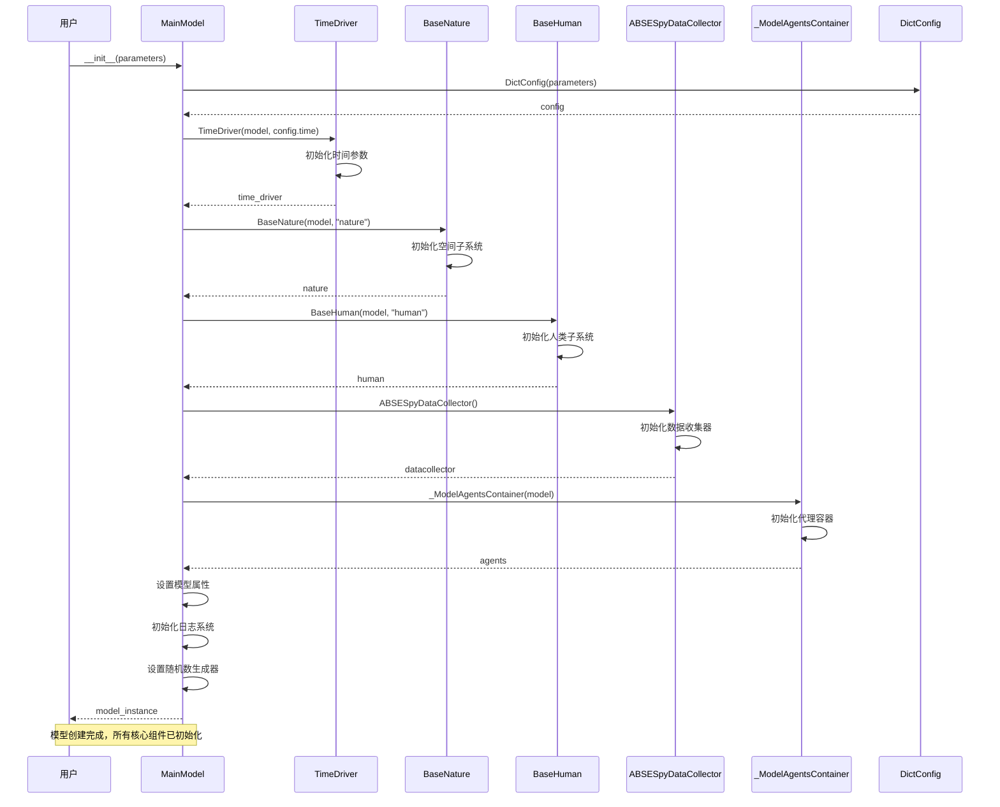

# 模型创建与初始化

用户创建模型并初始化的完整流程。

## 场景描述

用户通过配置参数创建 ABSESpy 模型，系统自动初始化所有核心组件，包括时间驱动、自然子系统、人类子系统、数据收集器等。

## 时序图



## 关键步骤说明

### 1. 配置处理
- 用户传入 `parameters` 配置字典
- 系统创建 `DictConfig` 对象进行结构化配置管理
- 支持嵌套配置访问：`model.nature.params.parameter_name`

### 2. 时间驱动初始化
- 创建 `TimeDriver` 实例
- 从配置中读取时间参数（开始时间、结束时间、时间步长等）
- 初始化时间状态和计数器

### 3. 子系统初始化
- **BaseNature**: 初始化空间子系统，管理空间模块
- **BaseHuman**: 初始化人类子系统，管理人类模块
- 两个子系统都继承自 `BaseSubSystem`

### 4. 数据收集器初始化
- 创建 `ABSESpyDataCollector` 实例
- 初始化模型报告器、代理报告器、最终报告器
- 准备数据收集框架

### 5. 代理容器初始化
- 创建 `_ModelAgentsContainer` 实例
- 初始化代理管理功能
- 连接到 Mesa 的代理系统

### 6. 模型属性设置
- 设置模型名称、版本、输出路径等属性
- 初始化日志系统
- 设置随机数生成器

## 配置示例

```python
# 用户配置
config = {
    "model": {
        "name": "agricultural_model",
        "seed": 42
    },
    "time": {
        "start": "2020-01-01",
        "end": "2025-12-31",
        "freq": "1Y"
    },
    "nature": {
        "crs": "EPSG:4326"
    },
    "human": {
        "modules": ["social", "economic"]
    }
}

# 创建模型
model = MainModel(parameters=config)
```

## 初始化后的状态

创建完成后，模型实例包含以下核心组件：

- `model.time`: 时间驱动，管理仿真时间
- `model.nature`: 自然子系统，管理空间模块
- `model.human`: 人类子系统，管理人类模块
- `model.agents`: 代理容器，管理所有代理
- `model.datacollector`: 数据收集器，收集仿真数据
- `model.params`: 配置参数，支持嵌套访问
- `model.outpath`: 输出路径，用于保存结果

## 相关文件

- `abses/core/model.py`: MainModel 主类实现
- `abses/core/time_driver.py`: TimeDriver 时间驱动
- `abses/space/nature.py`: BaseNature 空间子系统
- `abses/human/human.py`: BaseHuman 人类子系统
- `abses/utils/datacollector.py`: ABSESpyDataCollector 数据收集器
