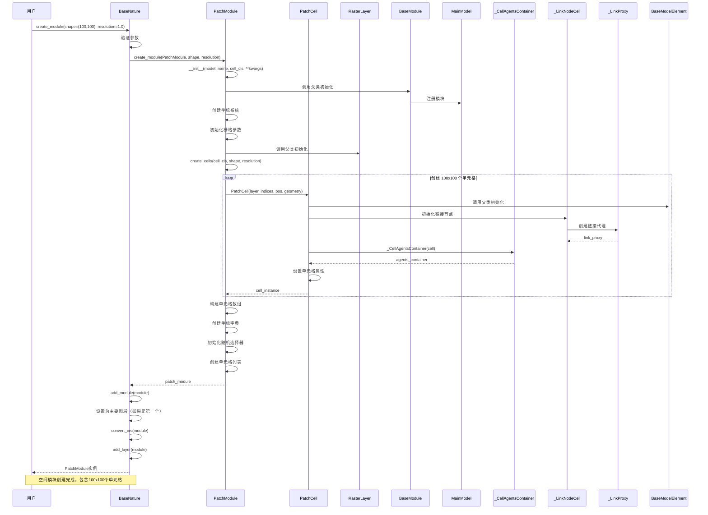

# 创建空间环境

用户创建空间模块和环境的完整流程。

## 场景描述

用户通过自然子系统创建空间模块，系统自动初始化栅格数据、创建单元格数组、设置空间属性，并提供空间数据管理功能。

## 时序图



## 关键步骤说明

### 1. 空间模块创建
- 用户调用 `model.nature.create_module(shape=(100,100), resolution=1.0)`
- `BaseNature` 验证参数并调用 `create_module()` 方法
- 创建 `PatchModule` 实例

### 2. 模块初始化
- `PatchModule` 继承自 `BaseModule` 和 `RasterLayer`
- 调用父类初始化方法
- 注册模块到主模型

### 3. 坐标系统设置
- 根据 `shape` 和 `resolution` 创建坐标系统
- 初始化栅格参数（高度、宽度、分辨率等）
- 设置坐标参考系统（CRS）

### 4. 单元格创建
- 循环创建 100×100 = 10,000 个单元格
- 每个单元格包含：
  - 空间位置信息（indices, pos, geometry）
  - 代理容器（_CellAgentsContainer）
  - 网络链接功能（_LinkNodeCell, _LinkProxy）

### 5. 模块配置
- 构建单元格数组和坐标字典
- 初始化随机选择器
- 创建单元格列表（ActorsList）

### 6. 子系统集成
- 将模块添加到自然子系统
- 如果是第一个模块，设置为主要图层
- 转换坐标参考系统
- 添加到图层集合

## 使用示例

```python
# 从分辨率创建空间模块
landscape = model.nature.create_module(
    shape=(100, 100),
    resolution=1.0,
    name="landscape"
)

# 从栅格文件创建
elevation = PatchModule.from_raster(
    model=model,
    raster_file="elevation.tif",
    name="elevation"
)

# 从矢量文件创建
landuse = PatchModule.from_vector(
    model=model,
    vector_file="landuse.shp",
    name="landuse"
)

# 从 xarray 创建
temperature = PatchModule.from_xarray(
    model=model,
    xda=temperature_data,
    attr_name="temperature",
    name="temperature"
)
```

## 空间数据管理

创建的空间模块支持以下数据操作：

```python
# 应用栅格数据
landscape.apply_raster(elevation_data, "elevation")
landscape.apply_raster(fertility_data, "fertility")

# 获取栅格数据
elevation_array = landscape.get_raster("elevation")
fertility_array = landscape.get_raster("fertility")

# 设置栅格数据
landscape.set_raster("water", water_data)

# 转换为 GeoDataFrame
gdf = landscape.to_geodataframe()
```

## 单元格操作

空间模块中的单元格支持以下操作：

```python
# 获取单元格
cell = landscape.get_cell((50, 50))

# 获取单元格属性
elevation = cell.elevation
fertility = cell.fertility

# 设置单元格属性
cell.fertility = 0.8

# 获取邻居单元格
neighbors = cell.get_neighbors(radius=2)

# 计算距离
distance = cell.distance_to(other_cell)
```

## 代理空间管理

单元格可以管理代理：

```python
# 在单元格中创建代理
cell.agents.new(Farmer, num=5)

# 获取单元格中的代理
farmers = cell.agents[Farmer]

# 检查单元格状态
is_empty = cell.is_empty
is_full = cell.is_full
```

## 空间查询

空间模块支持各种查询操作：

```python
# 过滤单元格
fertile_cells = landscape.get_cells(lambda c: c.fertility > 0.5)
high_elevation = landscape.get_cells(lambda c: c.elevation > 1000)

# 随机选择单元格
random_cell = landscape.random.choice()

# 批量操作单元格
landscape.cells_lst.update("fertility", 0.5)
```

## 自定义单元格

用户可以创建自定义单元格类：

```python
class CustomCell(PatchCell):
    def __init__(self, *args, **kwargs):
        super().__init__(*args, **kwargs)
        self._fertility = 0.5
        self._water = 0.0

    @raster_attribute
    def fertility(self):
        return self._fertility

    @fertility.setter
    def fertility(self, value):
        self._fertility = value

    @raster_attribute
    def water(self):
        return self._water

    @water.setter
    def water(self, value):
        self._water = value

# 使用自定义单元格创建模块
custom_module = model.nature.create_module(
    shape=(50, 50),
    cell_cls=CustomCell,
    name="custom"
)
```

## 相关文件

- `abses/space/nature.py`: BaseNature 空间子系统
- `abses/space/patch.py`: PatchModule 栅格模块
- `abses/space/cells.py`: PatchCell 栅格单元
- `abses/agents/container.py`: _CellAgentsContainer 单元格代理容器
- `abses/human/links.py`: 网络链接功能
