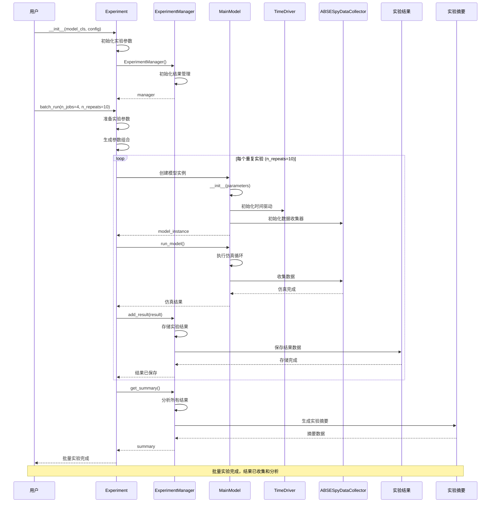

# 批量实验

用户运行批量实验的完整流程。

## 场景描述

用户创建实验配置，运行多个模型实例的批量实验，系统自动管理实验参数、并行执行、结果收集和分析。

## 时序图



## 关键步骤说明

### 1. 实验初始化
- 用户创建 `Experiment` 实例
- 传入模型类和配置参数
- 初始化 `ExperimentManager` 管理实验结果

### 2. 参数准备
- 系统准备实验参数组合
- 生成不同的参数配置
- 准备并行执行环境

### 3. 批量执行
- 循环执行指定数量的重复实验
- 每个重复实验创建独立的模型实例
- 并行执行多个实验实例

### 4. 模型实例创建
- 为每个实验创建新的 `MainModel` 实例
- 使用不同的参数配置
- 初始化时间驱动和数据收集器

### 5. 仿真执行
- 每个模型实例独立运行仿真
- 收集仿真数据和结果
- 记录实验状态和性能指标

### 6. 结果管理
- `ExperimentManager` 收集所有实验结果
- 存储实验数据和元数据
- 生成实验摘要和统计信息

## 使用示例

### 基本批量实验
```python
# 定义实验配置
config = {
    "model": {
        "name": "agricultural_experiment",
        "seed": 42
    },
    "time": {
        "start": "2020-01-01",
        "end": "2025-12-31",
        "freq": "1Y"
    },
    "agents": {
        "farmers": {"num": 100, "energy": 100},
        "hunters": {"num": 50, "strength": 80}
    }
}

# 创建实验
experiment = Experiment(
    model_cls=AgriculturalModel,
    config=config
)

# 运行批量实验
results = experiment.batch_run(
    n_jobs=4,      # 并行作业数
    n_repeats=10   # 重复次数
)
```

### 参数扫描实验
```python
# 定义参数扫描
param_scan = {
    "agents.farmers.num": [50, 100, 150, 200],
    "agents.farmers.energy": [80, 100, 120],
    "time.freq": ["1Y", "2Y", "5Y"]
}

# 创建参数扫描实验
experiment = Experiment(
    model_cls=AgriculturalModel,
    config=base_config,
    param_scan=param_scan
)

# 运行参数扫描
results = experiment.batch_run(n_jobs=8, n_repeats=5)
```

### 自定义实验模型
```python
class AgriculturalModel(MainModel):
    def __init__(self, parameters, **kwargs):
        super().__init__(parameters, **kwargs)
        self.setup_agricultural_environment()

    def setup_agricultural_environment(self):
        # 创建农业环境
        self.nature.create_module(
            shape=(100, 100),
            resolution=1.0,
            name="farmland"
        )

        # 创建农民和猎人
        self.agents.new(Farmer, num=self.params.agents.farmers.num)
        self.agents.new(Hunter, num=self.params.agents.hunters.num)

    def step(self):
        super().step()
        self.agricultural_step()

    def agricultural_step(self):
        # 农业相关的步骤逻辑
        farmers = self.agents[Farmer]
        farmers.shuffle_do("harvest")

        hunters = self.agents[Hunter]
        hunters.shuffle_do("hunt")
```

## 实验管理

### 结果收集
```python
# 配置数据收集
experiment.setup_data_collection(
    model_reporters={
        "population": lambda m: len(m.agents),
        "total_energy": lambda m: sum(a.energy for a in m.agents)
    },
    agent_reporters={
        "energy": "energy",
        "wealth": "wealth"
    }
)
```

### 实验监控
```python
# 设置实验监控
def monitor_experiment(experiment_id, status, result):
    print(f"Experiment {experiment_id}: {status}")
    if result:
        print(f"Population: {result['final_population']}")

experiment.set_monitor(monitor_experiment)
```

### 结果分析
```python
# 获取实验结果
results = experiment.get_results()

# 分析结果
summary = experiment.summary()
print(f"Total experiments: {summary['total_experiments']}")
print(f"Success rate: {summary['success_rate']}")
print(f"Average population: {summary['avg_population']}")

# 保存结果
experiment.save_results("experiment_results.csv")
```

## 并行处理

### 本地并行
```python
# 使用多核并行
experiment.batch_run(n_jobs=4, n_repeats=100)
```

### 分布式并行
```python
# 使用分布式计算
experiment.batch_run(
    n_jobs=16,
    n_repeats=1000,
    backend="dask",
    cluster="local"
)
```

### 云并行
```python
# 使用云服务
experiment.batch_run(
    n_jobs=100,
    n_repeats=10000,
    backend="aws",
    instance_type="c5.large"
)
```

## 实验配置

### 配置文件
```yaml
# experiment_config.yaml
model:
  name: "agricultural_experiment"
  seed: 42

time:
  start: "2020-01-01"
  end: "2025-12-31"
  freq: "1Y"

agents:
  farmers:
    num: 100
    energy: 100
    skill: 0.7
  hunters:
    num: 50
    strength: 80
    efficiency: 0.6

nature:
  crs: "EPSG:4326"
  modules:
    - name: "farmland"
      shape: [100, 100]
      resolution: 1.0

human:
  modules:
    - name: "social"
    - name: "economic"
```

### 参数扫描配置
```yaml
# param_scan.yaml
param_scan:
  agents.farmers.num: [50, 100, 150, 200]
  agents.farmers.energy: [80, 100, 120]
  agents.hunters.num: [25, 50, 75]
  time.freq: ["1Y", "2Y", "5Y"]

constraints:
  agents.farmers.num + agents.hunters.num: "< 300"
  agents.farmers.energy: "> 50"
```

## 结果分析

### 统计分析
```python
# 基本统计
summary = experiment.summary()
print(f"Mean population: {summary['mean_population']}")
print(f"Std population: {summary['std_population']}")
print(f"Min population: {summary['min_population']}")
print(f"Max population: {summary['max_population']}")

# 参数敏感性分析
sensitivity = experiment.analyze_sensitivity()
print(sensitivity)
```

### 可视化分析
```python
# 结果可视化
experiment.plot_results(
    x="farmers_num",
    y="final_population",
    hue="hunters_num"
)

# 参数影响分析
experiment.plot_parameter_effects()
```

## 相关文件

- `abses/core/experiment.py`: Experiment 实验管理
- `abses/core/job_manager.py`: ExperimentManager 作业管理
- `abses/core/model.py`: MainModel 主模型
- `abses/utils/datacollector.py`: ABSESpyDataCollector 数据收集
- `abses/core/time_driver.py`: TimeDriver 时间驱动
