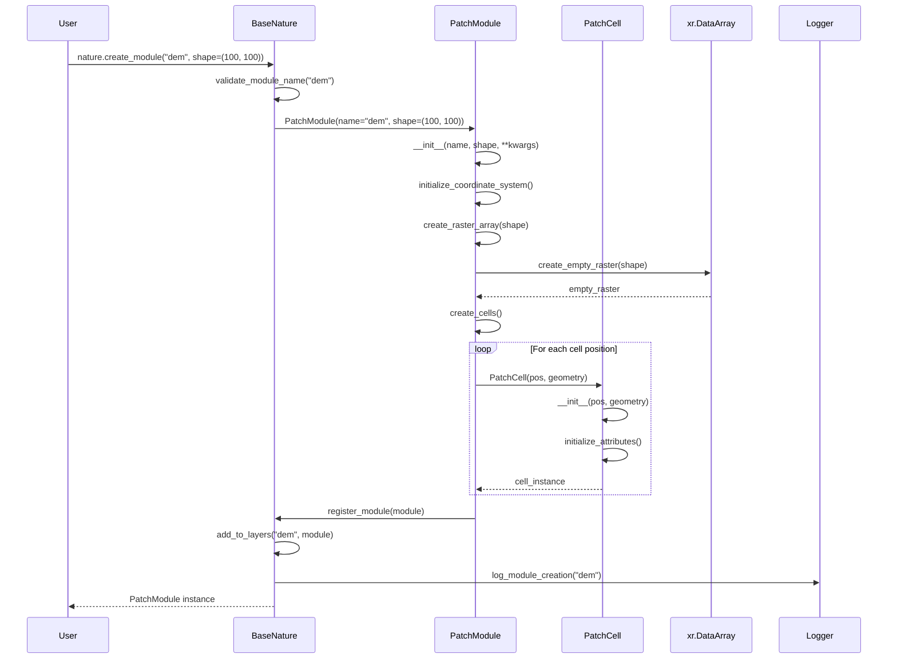
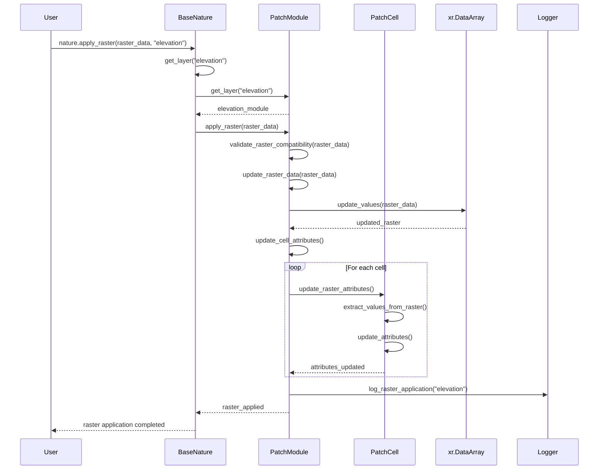
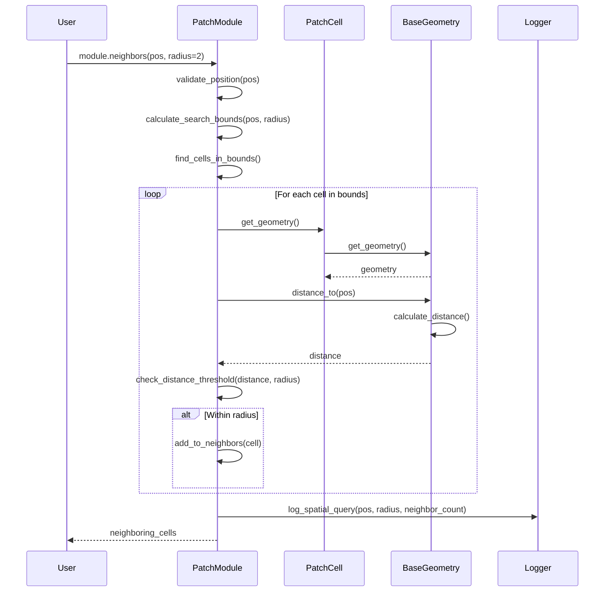
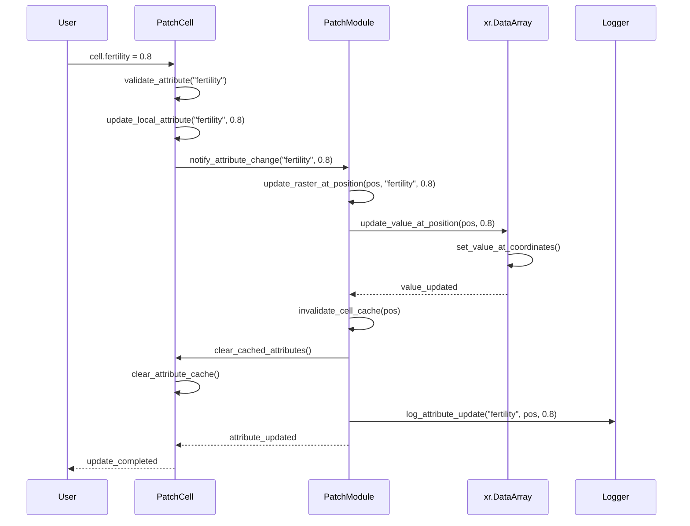

# ABSESpy Space Module Sequence Diagrams

This document contains sequence diagrams for the space module, showing the interactions between BaseNature, PatchModule, PatchCell, and raster operations.

## Spatial Module Creation Sequence



## Raster Application Sequence



## Cell Agent Interaction Sequence

```mermaid
sequenceDiagram
    participant Actor
    participant PatchCell
    participant _CellAgentsContainer
    participant PatchModule
    participant Logger

    Actor->>PatchCell: cell.add_agent(actor)

    PatchCell->>PatchCell: validate_agent(actor)
    PatchCell->>_CellAgentsContainer: add_agent(actor)
    _CellAgentsContainer->>_CellAgentsContainer: register_agent(actor)
    _CellAgentsContainer->>Actor: set_cell_reference(cell)

    PatchCell->>PatchModule: notify_agent_added(actor)
    PatchModule->>PatchModule: update_cell_statistics()

    PatchCell->>Logger: log_agent_addition(actor)
    PatchCell-->>Actor: agent_added_successfully

    Note over Actor,Logger: Agent can now access cell attributes

    Actor->>PatchCell: cell.fertility
    PatchCell->>PatchCell: get_raster_attribute("fertility")
    PatchCell-->>Actor: fertility_value

    Actor->>PatchCell: cell.neighbors(radius=1)
    PatchCell->>PatchModule: get_neighbors(pos, radius)
    PatchModule->>PatchModule: find_neighboring_cells()
    PatchModule-->>PatchCell: neighboring_cells
    PatchCell-->>Actor: neighbor_cells
```

## Raster Attribute Access Sequence

```mermaid
sequenceDiagram
    participant Actor
    participant PatchCell
    participant PatchModule
    participant xr.DataArray
    participant Logger

    Actor->>PatchCell: cell.fertility

    PatchCell->>PatchCell: get_raster_attribute("fertility")
    PatchCell->>PatchModule: get_raster_value(pos, "fertility")

    PatchModule->>PatchModule: validate_attribute_exists("fertility")
    PatchModule->>xr.DataArray: sel(x=pos[0], y=pos[1])
    xr.DataArray->>xr.DataArray: extract_value_at_position()
    xr.DataArray-->>PatchModule: raster_value

    PatchModule->>PatchModule: process_raster_value(value)
    PatchModule-->>PatchCell: processed_value
    PatchCell->>PatchCell: cache_attribute_value("fertility", value)
    PatchCell-->>Actor: fertility_value

    Note over Actor,Logger: Value is cached for future access

    Actor->>PatchCell: cell.fertility
    PatchCell->>PatchCell: get_cached_attribute("fertility")
    PatchCell-->>Actor: cached_value
```

## Spatial Query Sequence



## Cell Attribute Update Sequence



## Key Interactions

### Spatial Module Creation
1. **Module Validation**: Module name and parameters are validated
2. **Raster Initialization**: Empty raster array is created
3. **Cell Creation**: Individual cells are created for each position
4. **Registration**: Module is registered with BaseNature
5. **Logging**: Creation process is logged

### Raster Application
1. **Compatibility Check**: Raster data is validated for compatibility
2. **Data Update**: Raster array is updated with new data
3. **Cell Update**: All cells are updated with new attribute values
4. **Caching**: Attribute values are cached for performance
5. **Logging**: Application process is logged

### Cell Agent Interaction
1. **Agent Validation**: Agent is validated before addition
2. **Container Update**: Agent is added to cell's agent container
3. **Reference Setting**: Agent's cell reference is set
4. **Statistics Update**: Cell statistics are updated
5. **Logging**: Agent addition is logged

### Raster Attribute Access
1. **Position Lookup**: Raster value is extracted at cell position
2. **Value Processing**: Raw raster value is processed
3. **Caching**: Value is cached for future access
4. **Return**: Processed value is returned to caller

### Spatial Query
1. **Bounds Calculation**: Search bounds are calculated
2. **Distance Calculation**: Distance to each cell is calculated
3. **Threshold Check**: Cells within radius are identified
4. **Result Collection**: Neighboring cells are collected
5. **Logging**: Query results are logged

### Cell Attribute Update
1. **Validation**: Attribute update is validated
2. **Local Update**: Cell's local attribute is updated
3. **Raster Update**: Raster data is updated at position
4. **Cache Invalidation**: Cached values are cleared
5. **Logging**: Update process is logged
