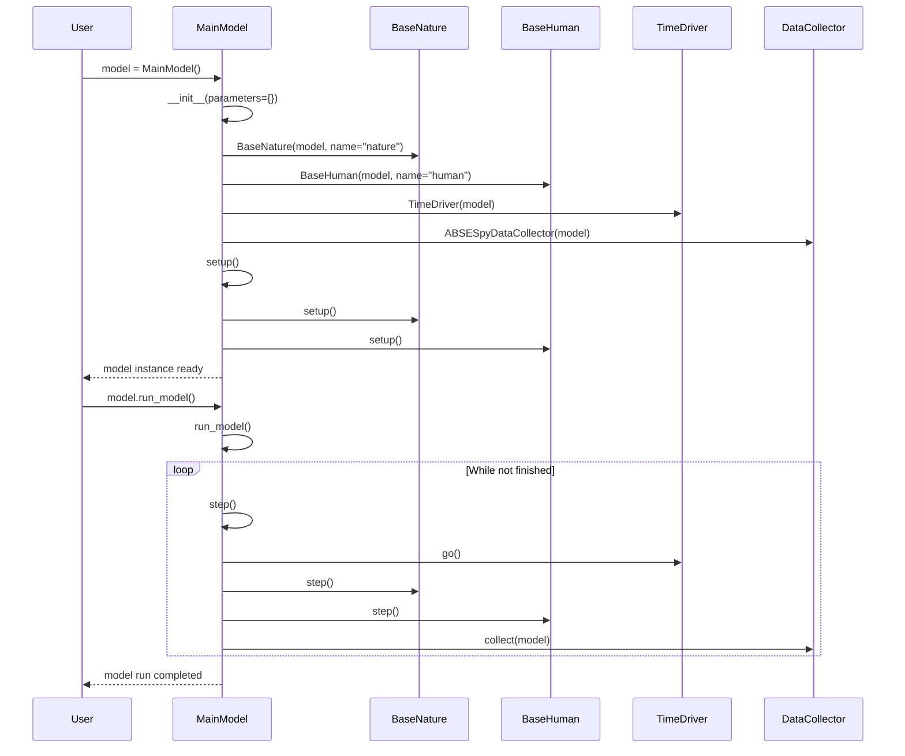
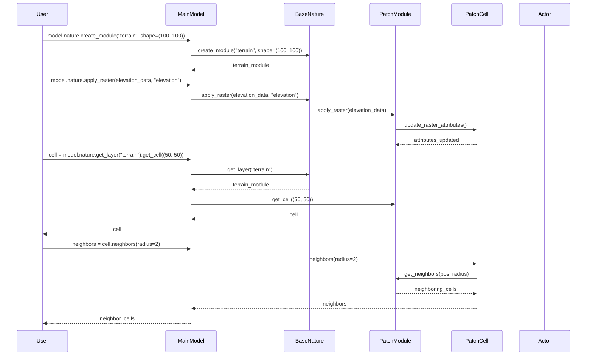

# ABSESpy User Scenario Sequence Diagrams

This document contains sequence diagrams for common user scenarios in ABSESpy, showing how users typically interact with the system.

## Scenario 1: Creating a Simple Model



## Scenario 2: Adding Agents to the Model

```mermaid
sequenceDiagram
    participant User
    participant MainModel
    participant _ModelAgentsContainer
    participant Actor
    participant PatchCell

    User->>MainModel: model.agents.new(Farmer, num=10)

    MainModel->>_ModelAgentsContainer: new(Farmer, num=10)

    loop For each farmer (10 times)
        _ModelAgentsContainer->>Actor: Farmer(model)
        Actor->>Actor: __init__(model)
        _ModelAgentsContainer->>_ModelAgentsContainer: register_agent(actor)
    end

    _ModelAgentsContainer-->>MainModel: ActorsList[Farmer]
    MainModel-->>User: farmers_list

    User->>MainModel: model.nature.create_module("land", shape=(50, 50))
    MainModel->>BaseNature: create_module("land", shape=(50, 50))
    BaseNature-->>MainModel: land_module

    User->>MainModel: farmers_list.random_choice().move((25, 25))
    MainModel->>Actor: move((25, 25))
    Actor->>PatchCell: add_agent(actor)
    PatchCell-->>Actor: agent_placed
```

## Scenario 3: Running a Simulation

```mermaid
sequenceDiagram
    participant User
    participant MainModel
    participant TimeDriver
    participant BaseNature
    participant BaseHuman
    participant DataCollector
    participant Actor

    User->>MainModel: model.run_model()

    MainModel->>MainModel: setup()
    MainModel->>BaseNature: setup()
    MainModel->>BaseHuman: setup()

    loop For each time step
        MainModel->>TimeDriver: go()
        TimeDriver->>TimeDriver: step()

        MainModel->>BaseNature: step()
        BaseNature->>BaseNature: update_spatial_state()

        MainModel->>BaseHuman: step()
        BaseHuman->>BaseHuman: update_human_state()

        MainModel->>Actor: step()
        Actor->>Actor: execute_agent_logic()

        MainModel->>DataCollector: collect(model)
        DataCollector->>DataCollector: collect_model_vars()
        DataCollector->>DataCollector: collect_agent_vars()

        MainModel->>TimeDriver: is_finished()
        TimeDriver-->>MainModel: boolean result
    end

    MainModel->>DataCollector: get_model_vars_dataframe()
    DataCollector-->>MainModel: DataFrame
    MainModel-->>User: simulation_results
```

## Scenario 4: Data Collection and Analysis

```mermaid
sequenceDiagram
    participant User
    participant MainModel
    participant DataCollector
    participant Actor
    participant PatchCell

    User->>MainModel: model.datacollector.collect(model)

    MainModel->>DataCollector: collect(model)

    DataCollector->>DataCollector: collect_model_vars()
    DataCollector->>MainModel: call model reporters
    MainModel-->>DataCollector: model data

    DataCollector->>DataCollector: collect_agent_vars()
    DataCollector->>Actor: call agent reporters
    Actor-->>DataCollector: agent data

    DataCollector->>DataCollector: store_data()

    User->>MainModel: model.datacollector.get_model_vars_dataframe()
    MainModel->>DataCollector: get_model_vars_dataframe()
    DataCollector-->>MainModel: DataFrame
    MainModel-->>User: model_dataframe

    User->>MainModel: model.datacollector.get_agent_vars_dataframe()
    MainModel->>DataCollector: get_agent_vars_dataframe()
    DataCollector-->>MainModel: DataFrame
    MainModel-->>User: agent_dataframe
```

## Scenario 5: Spatial Operations



## Scenario 6: Agent Interactions

```mermaid
sequenceDiagram
    participant User
    participant MainModel
    participant Actor
    participant PatchCell
    participant _CellAgentsContainer

    User->>MainModel: farmers = model.agents.select(lambda a: a.energy > 50)
    MainModel->>_ModelAgentsContainer: select(lambda a: a.energy > 50)
    _ModelAgentsContainer-->>MainModel: filtered_farmers
    MainModel-->>User: farmers

    User->>MainModel: farmers.shuffle_do("work")
    MainModel->>Actor: work()
    Actor->>Actor: execute_work_logic()
    Actor->>PatchCell: access_cell_resources()
    PatchCell-->>Actor: resources_available

    User->>MainModel: farmers.apply(lambda a: a.collect_resources())
    MainModel->>Actor: collect_resources()
    Actor->>PatchCell: extract_resources()
    PatchCell->>PatchCell: update_resource_level()
    PatchCell-->>Actor: resources_collected

    User->>MainModel: farmers.select(lambda a: a.energy < 20).die()
    MainModel->>Actor: die()
    Actor->>Actor: set_alive_status(False)
    Actor->>PatchCell: remove_agent(actor)
    PatchCell->>_CellAgentsContainer: remove_agent(actor)
    _CellAgentsContainer-->>PatchCell: agent_removed
```

## Key User Patterns

### Model Creation Pattern
1. **Initialize Model**: Create MainModel instance
2. **Setup Subsystems**: BaseNature, BaseHuman are automatically created
3. **Run Model**: Execute simulation with run_model()

### Agent Management Pattern
1. **Create Agents**: Use model.agents.new() to create agent collections
2. **Select Agents**: Use select() to filter agents based on criteria
3. **Batch Operations**: Use shuffle_do() or apply() for batch operations
4. **Agent Lifecycle**: Manage agent creation, movement, and death

### Data Collection Pattern
1. **Define Reporters**: Set up model and agent reporters
2. **Collect Data**: Use datacollector.collect() during simulation
3. **Extract Results**: Use get_model_vars_dataframe() and get_agent_vars_dataframe()
4. **Analyze Data**: Process collected data for analysis

### Spatial Operations Pattern
1. **Create Modules**: Use nature.create_module() to create spatial layers
2. **Apply Rasters**: Use nature.apply_raster() to add spatial data
3. **Access Cells**: Use get_cell() to access specific spatial units
4. **Spatial Queries**: Use neighbors() for spatial relationships

### Agent Interactions Pattern
1. **Filter Agents**: Use select() to find specific agent subsets
2. **Batch Operations**: Use shuffle_do() for random batch execution
3. **Resource Access**: Agents interact with cells for resources
4. **Lifecycle Management**: Manage agent creation, movement, and death
