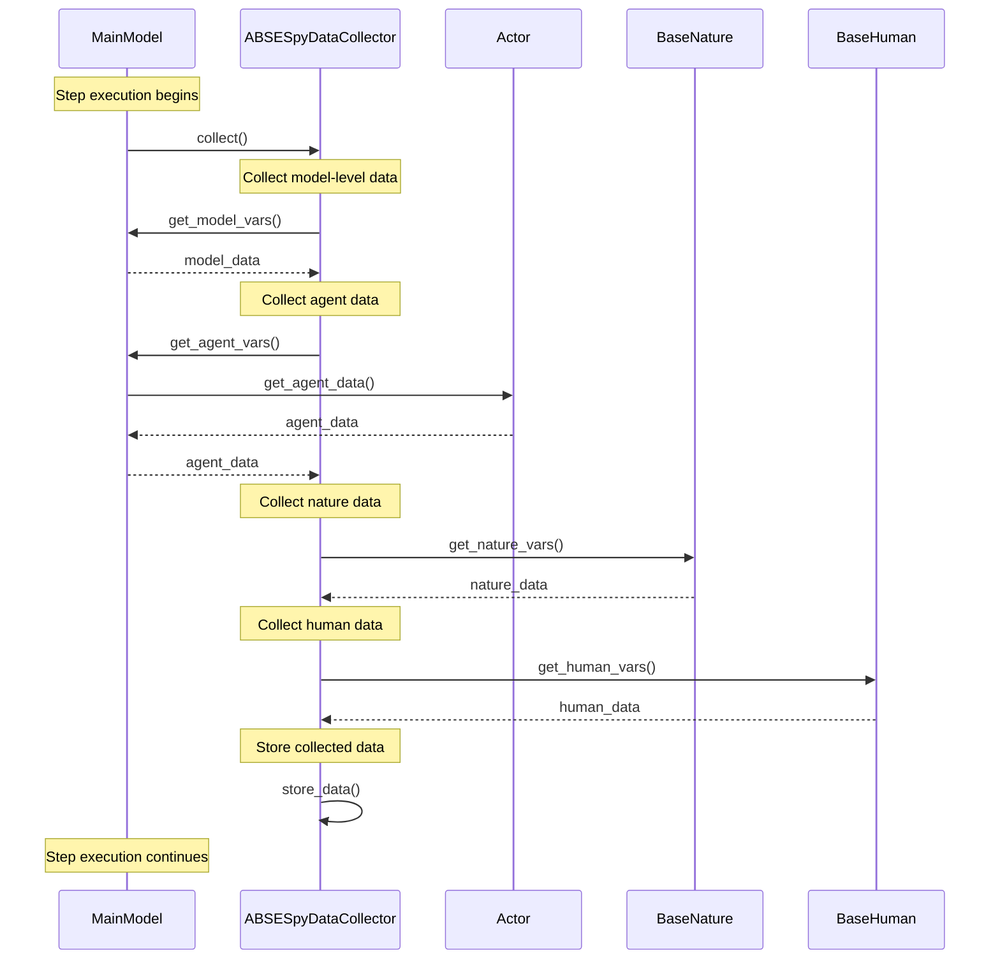
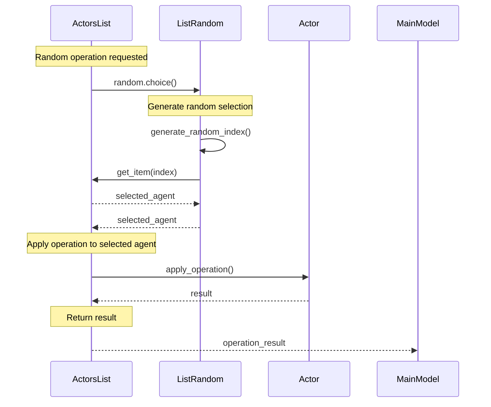
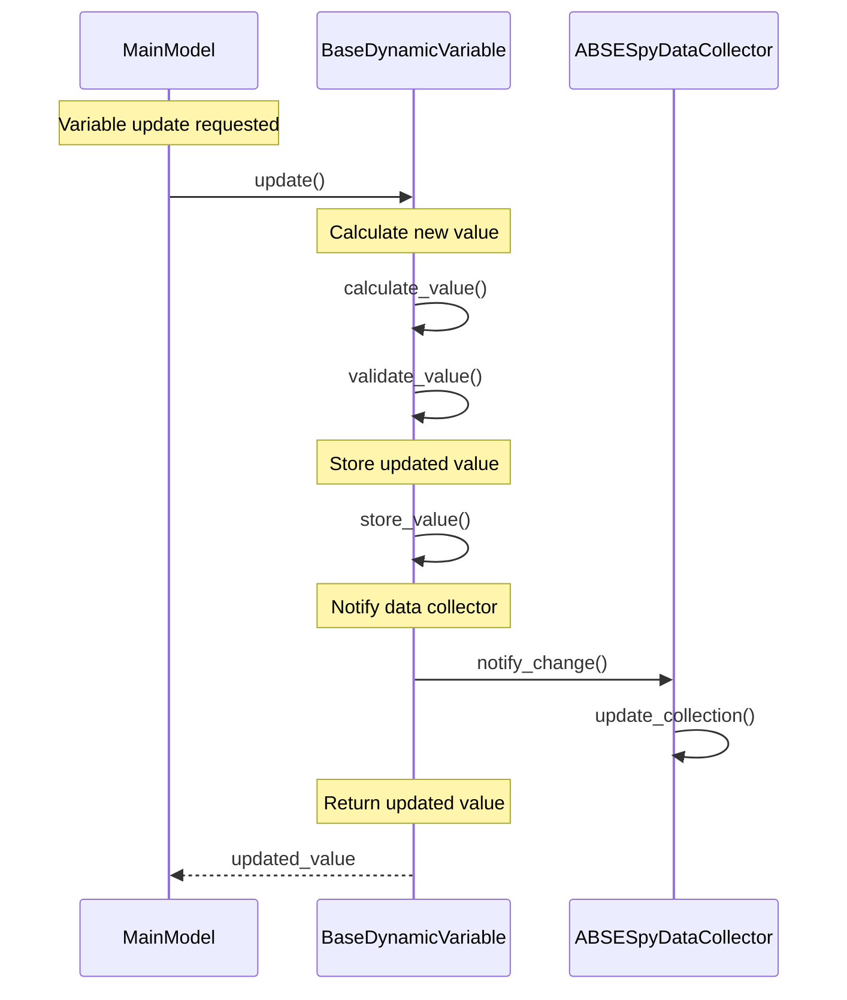
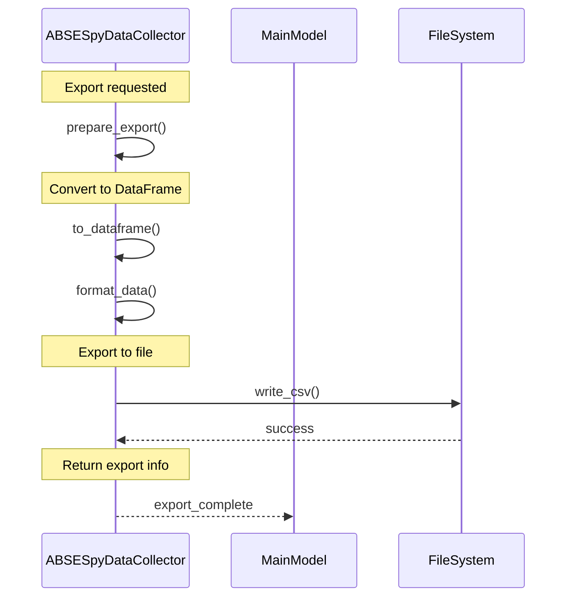
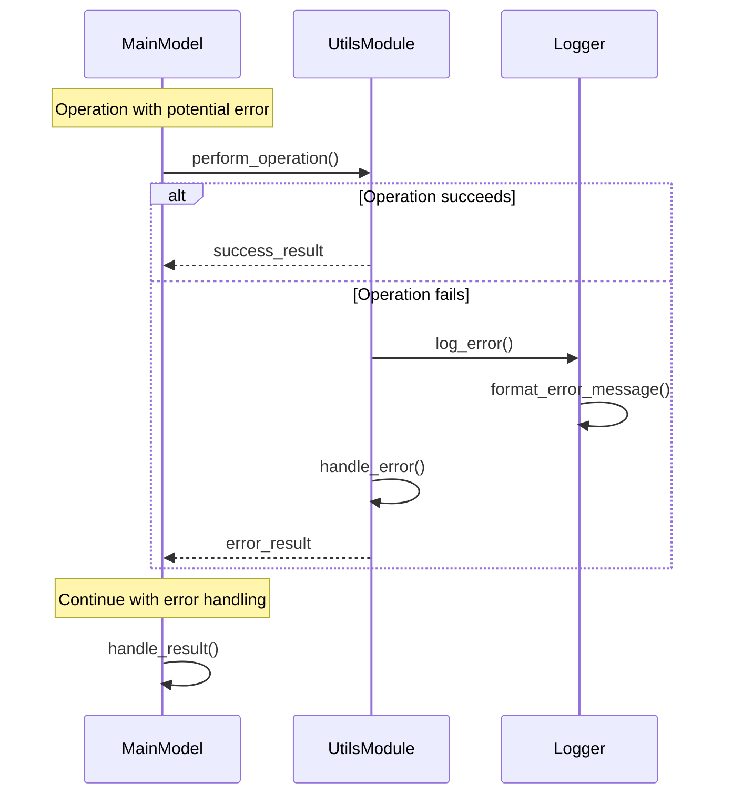

# Utils Module Sequence Diagrams

This document contains sequence diagrams for the Utils module, showing the key flows for data collection and random operations.

## Data Collection Flow

This diagram shows how data is collected during simulation steps.

## Random Operations Flow

This diagram shows how random operations are performed on agent lists.

## Variable Management Flow

This diagram shows how dynamic variables are managed and updated.

## Data Export Flow

This diagram shows how collected data is exported to different formats.

## Error Handling Flow

This diagram shows how errors are handled in utility operations.

